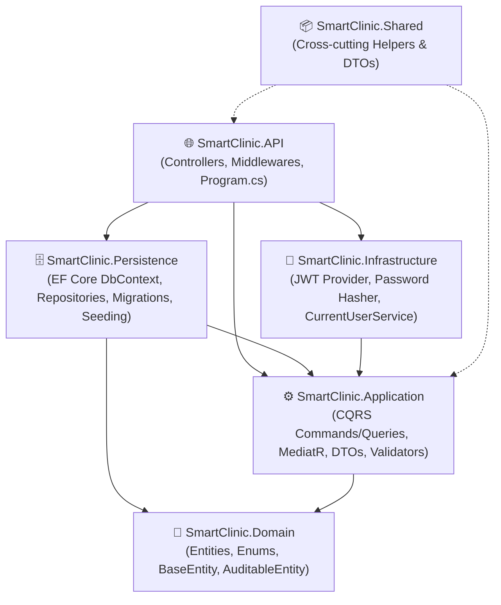
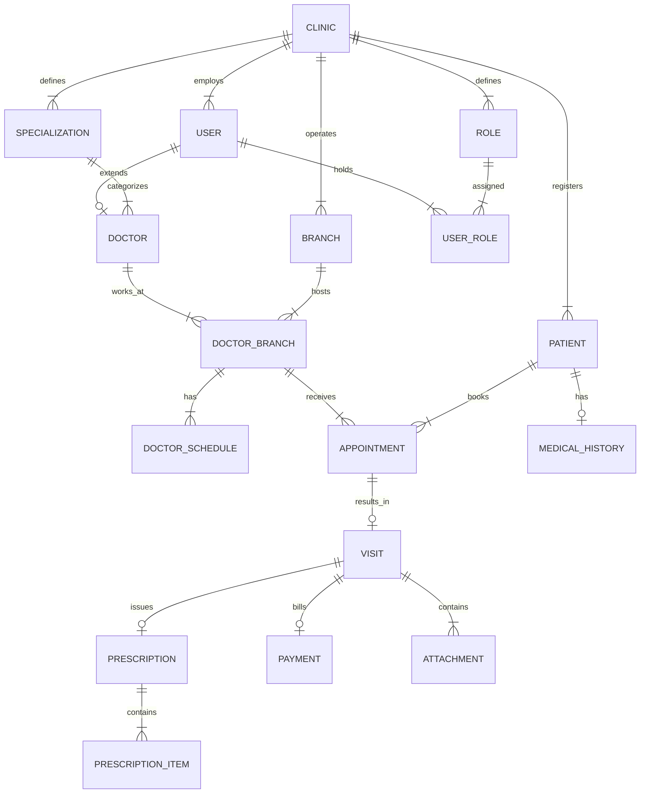

# 🏥 SmartClinic — Enterprise Multi-Tenant Management System

[](https://dotnet.microsoft.com/)
[](https://docs.microsoft.com/en-us/aspnet/core/)
[](https://blog.cleancoder.com/uncle-bob/2012/08/13/the-clean-architecture.html)
[](https://github.com/jbogard/MediatR)
[](https://docs.microsoft.com/en-us/ef/core/)
[](https://www.microsoft.com/en-us/sql-server/)
[](https://jwt.io/)

SmartClinic is an enterprise-grade, multi-tenant clinic and medical center management system designed to streamline clinical workflows, patient management, doctor scheduling, queue tracking, electronic medical records (EMR), prescriptions, billing, and real-time dashboard analytics.

---

## 📋 Table of Contents

- [💡 Project Concept & Vision](#-project-concept--vision)
- [🏛️ System Architecture](#-system-architecture)
- [✨ Key Features & Modules](#-key-features--modules)
- [📊 Database Schema & Relationships](#-database-schema--relationships)
- [🔌 API Endpoints Reference](#-api-endpoints-reference)
- [🛠️ Tech Stack & Design Patterns](#%EF%B8%8F-tech-stack--design-patterns)
- [🚀 Quick Start & Local Setup](#-quick-start--local-setup)
- [🔒 Security & Multi-Tenancy Isolation](#-security--multi-tenancy-isolation)

---

## 💡 Project Concept & Vision

**SmartClinic** serves as a centralized SaaS-ready platform for managing independent medical clinics and multi-branch healthcare centers within a unified ecosystem.

### Core Objectives:
1. **Multi-Tenancy Isolation**: Support distinct medical clinics (`Clinic`) sharing the same infrastructure with isolated data boundaries enforced by `ClinicId`.
2. **Multi-Branch Operations**: Enable clinics to manage multiple physical locations (`Branch`) with location-specific doctors, consultation fees, and working hours.
3. **Smart Doctor Scheduling**: Allow flexible doctor-to-branch assignments (`DoctorBranch`) with configurable daily slots, consultation/follow-up fees, and limits.
4. **Queue & Appointment Management**: Dynamic daily queue generation (`QueueNumber`) preventing booking conflicts and tracking appointment state transitions (`Reserved` ➔ `Waiting` ➔ `InConsultation` ➔ `Completed`).
5. **Electronic Medical Records (EMR)**: Complete patient history tracking (chronic diseases, allergies, past surgeries, visit notes, attachments).
6. **Prescriptions & Billing**: Streamlined digital prescriptions with medication dosage details and structured payment processing (cash, card, insurance).
7. **Real-time Analytics**: High-performance dashboard providing operational visibility into total patients, active branches, active doctors, today's appointments, completed visits, and revenue.

---

## 🏛️ System Architecture

SmartClinic strictly adheres to **Clean Architecture** (Onion Architecture) principles, enforcing loose coupling, high testability, and strict separation of concerns across 5 distinct layers:



### Layer Breakdown:

| Project | Responsibility | Key Components |
| :--- | :--- | :--- |
| **`SmartClinic.Domain`** | Enterprise Core (Zero Dependencies) | Entities (`Clinic`, `Branch`, `User`, `Doctor`, `Patient`, `Visit`, `Prescription`, `Payment`), Enums, `AuditableEntity`. |
| **`SmartClinic.Application`** | Business Use Cases & Contracts | CQRS Handlers, `IMediator`, `FluentValidation` Rules, `AutoMapper` Profiles, Persistence Interfaces. |
| **`SmartClinic.Persistence`** | Data Access & Persistence | `SmartClinicDbContext`, Entity Configurations (Fluent API), Repository Implementations, Unit of Work, DB Seeding. |
| **`SmartClinic.Infrastructure`** | External Services & Auth | `JwtProvider`, `BCrypt` Password Hashing, `CurrentUserService` (Claim Extraction). |
| **`SmartClinic.API`** | Presentation Layer | REST API Controllers, Exception Handling Middleware, Swagger OpenAPI, CORS Policy. |

---

## ✨ Key Features & Modules

### 🔐 1. Authentication & Security
- **JWT Bearer Token Authentication**: Secure token generation containing user ID, email, role, and tenant `ClinicId`.
- **Refresh Token Support**: Long-lived refresh tokens with expiration tracking.
- **BCrypt Password Hashing**: Industry-standard cryptographic hashing for user credentials.
- **Claim-Based Authorization**: Role enforcement (`ClinicAdmin`, `Doctor`, `Receptionist`, `PlatformAdmin`).

### 🏢 2. Multi-Tenant Clinic & Branch Management
- **Clinic Provisioning**: Full clinic creation with subdomain mapping and contact info.
- **Multi-Branch Setup**: Add and update branch locations tied to specific clinics.

### 👨‍⚕️ 3. Doctor & Schedule Management
- **Specializations**: Assign medical specialties to doctors per clinic.
- **Branch Assignments**: Associate doctors with specific branches, setting custom consultation fees, follow-up fees, and slot durations.
- **Flexible Schedules**: Define day-of-week working hours (StartTime - EndTime) and max patient limits.

### 🧑‍🤝‍🧑 4. Patient Profile & Medical History
- **Auto Medical Code**: Unique medical code generation for patient lookup.
- **Search Engine**: Search patients by name, phone, or medical code.
- **Medical History (EMR)**: Record chronic conditions, drug allergies, past surgeries, and general medical notes.

### 📅 5. Appointment & Queue Tracking
- **Automated Queueing**: Sequential daily queue number generation per doctor branch.
- **Status Lifecycle**: Track appointment progress:
  - `Reserved` (1) ➔ `Waiting` (2) ➔ `InConsultation` (3) ➔ `Completed` (4) / `Cancelled` (5) / `NoShow` (6).

### 🩺 6. Clinical Visits & Prescriptions
- **Visit Initiation**: Transition from appointment to active visit, locking consultation records.
- **Diagnosis & EMR Notes**: Record chief complaint, physical examination findings, and diagnosis.
- **Digital Prescriptions**: Attach medication list with item details (drug name, dosage, frequency, duration, usage instructions).
- **Visit Attachments**: Support medical document and report file attachments.

### 💳 7. Billing & Payment Processing
- **Financial Processing**: Process visit payments with amount, discount, and net total calculation.
- **Payment Methods**: Support `Cash`, `Card`, and `Insurance`.
- **Payment Statuses**: Track `Pending`, `Paid`, and `PartiallyPaid`.

### 📊 8. Dynamic Dashboard Analytics
- Real-time aggregated statistics for clinic administrators:
  - Total registered patients count.
  - Active branches & active doctors count.
  - Today's booked appointments count.
  - Today's completed visits count.
  - Today's total net revenue ($/EGP).

---

## 📊 Database Schema & Relationships



---

## 🔌 API Endpoints Reference

### 🔐 Authentication (`/api/auth`)
| Method | Endpoint | Description | Auth Required |
| :--- | :--- | :--- | :--- |
| `POST` | `/api/auth/login` | User login & JWT token issuance | ❌ Public |
| `POST` | `/api/auth/register` | Register new user account | ❌ Public |

### 🏢 Clinics (`/api/clinics`)
| Method | Endpoint | Description | Auth Required |
| :--- | :--- | :--- | :--- |
| `GET` | `/api/clinics` | List all registered clinics | 🔒 Bearer JWT |
| `GET` | `/api/clinics/{id}` | Get clinic details by ID | 🔒 Bearer JWT |
| `POST` | `/api/clinics` | Provision a new clinic | 🔒 Bearer JWT |

### 🏬 Branches (`/api/branches`)
| Method | Endpoint | Description | Auth Required |
| :--- | :--- | :--- | :--- |
| `GET` | `/api/branches/clinic/{clinicId}` | Get all branches for a clinic | 🔒 Bearer JWT |
| `GET` | `/api/branches/{id}` | Get branch by ID | 🔒 Bearer JWT |
| `POST` | `/api/branches` | Create a new branch | 🔒 Bearer JWT |
| `PUT` | `/api/branches/{id}` | Update branch details | 🔒 Bearer JWT |

### 🩺 Specializations (`/api/specializations`)
| Method | Endpoint | Description | Auth Required |
| :--- | :--- | :--- | :--- |
| `GET` | `/api/specializations/clinic/{clinicId}` | Get all specializations in clinic | 🔒 Bearer JWT |
| `POST` | `/api/specializations` | Add new specialization | 🔒 Bearer JWT |

### 👨‍⚕️ Doctors (`/api/doctors`)
| Method | Endpoint | Description | Auth Required |
| :--- | :--- | :--- | :--- |
| `GET` | `/api/doctors/{id}` | Get doctor profile by ID | 🔒 Bearer JWT |
| `GET` | `/api/doctors/branch/{branchId}` | Get doctors assigned to branch | 🔒 Bearer JWT |
| `POST` | `/api/doctors` | Create doctor profile & user | 🔒 Bearer JWT |
| `POST` | `/api/doctors/assign-branch` | Assign doctor to branch with fees | 🔒 Bearer JWT |
| `POST` | `/api/doctors/schedule` | Define weekly working hours schedule | 🔒 Bearer JWT |

### 🧑‍🤝‍🧑 Patients (`/api/patients`)
| Method | Endpoint | Description | Auth Required |
| :--- | :--- | :--- | :--- |
| `GET` | `/api/patients/{id}` | Get patient details by ID | 🔒 Bearer JWT |
| `GET` | `/api/patients/search` | Search patients by code, name, or phone | 🔒 Bearer JWT |
| `POST` | `/api/patients` | Register new patient | 🔒 Bearer JWT |
| `POST` | `/api/patients/medical-history` | Add/Update patient medical history | 🔒 Bearer JWT |

### 📅 Appointments (`/api/appointments`)
| Method | Endpoint | Description | Auth Required |
| :--- | :--- | :--- | :--- |
| `GET` | `/api/appointments/doctor-branch/{id}` | List appointments for doctor branch & date | 🔒 Bearer JWT |
| `POST` | `/api/appointments/book` | Book new appointment (auto-queue) | 🔒 Bearer JWT |
| `PUT` | `/api/appointments/status` | Change appointment status | 🔒 Bearer JWT |

### 🩺 Visits (`/api/visits`)
| Method | Endpoint | Description | Auth Required |
| :--- | :--- | :--- | :--- |
| `GET` | `/api/visits/{id}` | Get clinical visit record | 🔒 Bearer JWT |
| `POST` | `/api/visits/start` | Start visit consultation | 🔒 Bearer JWT |
| `PUT` | `/api/visits/update` | Update diagnosis & doctor notes | 🔒 Bearer JWT |

### 💊 Prescriptions (`/api/prescriptions`)
| Method | Endpoint | Description | Auth Required |
| :--- | :--- | :--- | :--- |
| `GET` | `/api/prescriptions/visit/{visitId}` | Get prescription for a visit | 🔒 Bearer JWT |
| `POST` | `/api/prescriptions` | Create prescription & items | 🔒 Bearer JWT |

### 💳 Payments (`/api/payments`)
| Method | Endpoint | Description | Auth Required |
| :--- | :--- | :--- | :--- |
| `GET` | `/api/payments/visit/{visitId}` | Get payment details by visit ID | 🔒 Bearer JWT |
| `POST` | `/api/payments/process` | Record payment for a visit | 🔒 Bearer JWT |

### 📊 Dashboard (`/api/dashboard`)
| Method | Endpoint | Description | Auth Required |
| :--- | :--- | :--- | :--- |
| `GET` | `/api/dashboard/stats/{clinicId}` | Get dynamic dashboard metrics | 🔒 Bearer JWT |

---

## 🛠️ Tech Stack & Design Patterns

### Backend Framework
- **.NET 9.0 SDK**: Latest high-performance cross-platform runtime.
- **ASP.NET Core Web API**: RESTful API design with Swagger OpenAPI integration.
- **Entity Framework Core 9.0**: ORM with SQL Server provider & migrations.

### Architecture & Patterns
- **Clean Architecture (Onion)**: Clear dependency inversion rule.
- **CQRS (Command Query Responsibility Segregation)**: Segregation of read and write paths.
- **MediatR**: In-process messaging and pipeline behavior execution.
- **FluentValidation**: Automatic request validation pipeline middleware (`ValidationBehavior`).
- **AutoMapper**: Object-to-object transformation profiles.
- **Repository Pattern & Unit of Work**: Abstracted data layer operations.

---

## 🚀 Quick Start & Local Setup

### Prerequisites
1. [.NET 9.0 SDK](https://dotnet.microsoft.com/download/dotnet/9.0)
2. [SQL Server](https://www.microsoft.com/en-us/sql-server/sql-server-downloads) (or LocalDB / Docker container)

### Setup Steps

1. **Clone the repository**:
   ```bash
   git clone https://github.com/Said-Waleed/SmartClinic.git
   cd SmartClinic
   ```

2. **Configure Database Connection**:
   Update `SmartClinic.API/appsettings.json`:
   ```json
   {
     "ConnectionStrings": {
       "DefaultConnection": "Server=.;Database=SmartClinicDb;Trusted_Connection=True;TrustServerCertificate=True;"
     },
     "JwtSettings": {
       "SecretKey": "YOUR_SUPER_SECRET_KEY_WITH_AT_LEAST_32_CHARACTERS!",
       "Issuer": "SmartClinicAPI",
       "Audience": "SmartClinicClient",
       "ExpirationInMinutes": 120
     }
   }
   ```

3. **Apply Database Migrations**:
   ```bash
   dotnet ef database update --project SmartClinic.Persistence --startup-project SmartClinic.API
   ```

4. **Run the API Application**:
   ```bash
   dotnet run --project SmartClinic.API
   ```

5. **Access Swagger UI**:
   Open browser at: `https://localhost:7000/swagger` or `http://localhost:5000/swagger`

### 🔑 Initial Seed Credentials
On application startup, the `DbInitializer` automatically seeds an initial clinic and administrator account:
- **Email**: `admin@smartclinic.com`
- **Password**: `Admin@123`
- **Clinic Name**: `Smart Clinic`
