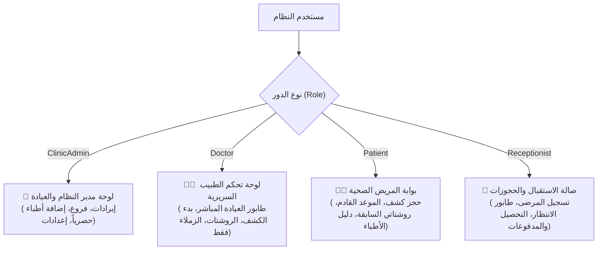
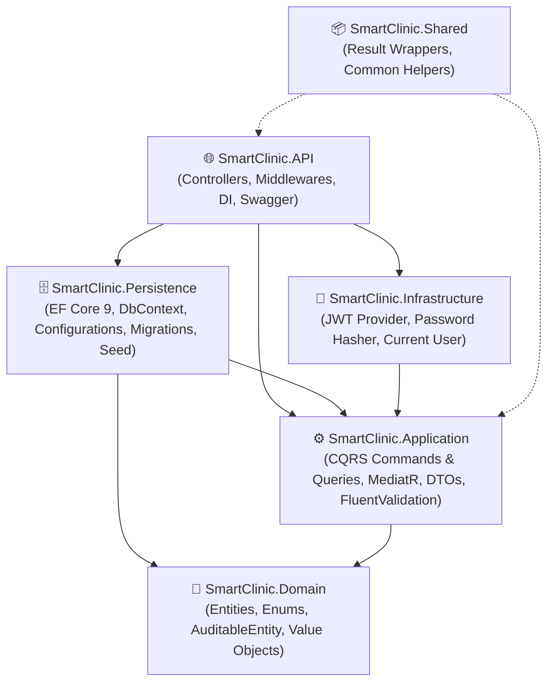
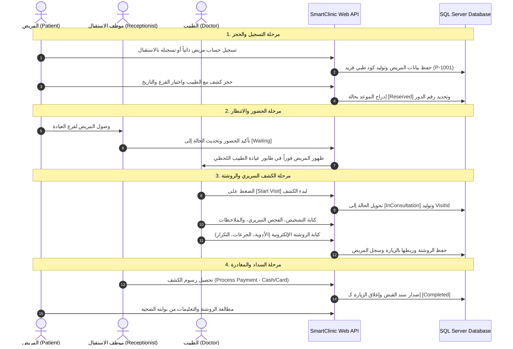

# 🏥 SmartClinic — Enterprise Multi-Tenant Smart Clinic Management System
### 📖 المرجع الشامل والوثيقة الهندسية الكاملة للمشروع (Comprehensive Master Documentation & Engineering Showcase)

[](https://dotnet.microsoft.com/)
[](https://angular.dev/)
[](https://blog.cleancoder.com/uncle-bob/2012/08/13/the-clean-architecture.html)
[](https://github.com/jbogard/MediatR)
[](https://docs.microsoft.com/en-us/ef/core/)
[](https://www.microsoft.com/en-us/sql-server/)
[](https://jwt.io/)
[](https://angular.dev/)

---

## 📌 الفهرس العام للمستند الشامل (Table of Contents)

1. [💡 فكرة المشروع والرؤية العامة (Executive Summary & Business Scope)](#1--فكرة-المشروع-والرؤية-العامة-executive-summary--business-scope)
2. [👥 منظومة الأدوار والصلاحيات الأربعة (The 4 Distinct User Roles & RBAC)](#2--منظومة-الأدوار-والصلاحيات-الأربعة-the-4-distinct-user-roles--rbac)
3. [🏛️ المعمارية الهندسية للباك إند (.NET 9 Clean Architecture & CQRS)](#3-%EF%B8%8F-المعمارية-الهندسية-للباك-إند-net-9-clean-architecture--cqrs)
4. [💻 بنية الواجهة الأمامية وتجربة المستخدم (Frontend Architecture — Angular 19)](#4--بنية-الواجهة-الأمامية-وتجربة-المستخدم-frontend-architecture--angular-19)
5. [🔄 دورة حياة الكشف الطبي الكاملة (End-to-End Patient Journey Workflow)](#5--دورة-حياة-الكشف-الطبي-الكاملة-end-to-end-patient-journey-workflow)
6. [🗄️ نموذج قاعدة البيانات والكيانات (Database Schema & Domain Entities)](#6-%EF%B8%8F-نموذج-قاعدة-البيانات-والكيانات-database-schema--domain-entities)
7. [🔑 جدول بيانات الدخول التجريبية (Pre-Seeded Accounts Matrix)](#7--جدول-بيانات-الدخول-التجريبية-pre-seeded-accounts-matrix)
8. [🚀 دليل التشغيل السريع بنقرة واحدة (Quick Start & 1-Click Run)](#8--دليل-التشغيل-السريع-بنقرة-واحدة-quick-start--1-click-run)
9. [🗂️ فهرس وثائق الشرح التفصيلية داخل مجلد docs (Detailed Docs Index)](#9-%EF%B8%8F-فهرس-وثائق-الشرح-التفصيلية-داخل-مجلد-docs-detailed-docs-index)

---

## 1. 💡 فكرة المشروع والرؤية العامة (Executive Summary & Business Scope)

**SmartClinic** هو نظام متكامل لإدارة العيادات والمراكز الطبية متعددة الفروع والمستأجرين (**Enterprise Multi-Tenant SaaS Platform**) تم بناؤه وفق أعلى المعايير الهندسية للمؤسسات الكبرى (**Enterprise-Grade Standards**).

### 🎯 ما المشكلات الواقعية التي يعالجها النظام؟
في إدارة العيادات والمراكز الطبية التقليدية، تعاني المنشآت الصحية من:
1. **عشوائية الحجوزات وتكدس المرضى**: غياب طابور انتظار منظم ومربوط لحظياً بين موظف الاستقبال وغرفة الكشف.
2. **فقدان التاريخ المرضي والحساسيات الدوائية**: الاعتماد على الملفات الورقية مما يهدد حياة المريض عند وصف أدوية تتعارض مع حالته.
3. **غياب الخصوصية الصارمة والخلط في الصلاحيات**: إمكانية اطلاع غير المصرح لهم على الأسرار والملفات الطبية للمرضى أو التلاعب بالمدفوعات.
4. **تعدد الفروع وصعوبة الإشراف المركزي**: صعوبة إدارة عدة مراكز جغرافية وتتبع إيرادات وجداول أطباء كل فرع بشكل لحظي.

### 🌟 الحلول الذكية التي يقدمها SmartClinic:
- **العزل السحابي التام لكل عيادة (Multi-Tenancy)** مع دعم الفروع الجغرافية المتعددة لنفس المركز.
- **منظومة صلاحيات رباعية حازمة (RBAC)** تفصل بدقة بين مهام (مدير المركز، الطبيب، المريض، وموظف الاستقبال).
- **ملف طبي إلكتروني كامل لكل مريض (EMR - Electronic Medical Records)** يشمل التشخيص، الفحص السريري، التاريخ المرضي، الحساسيات الدوائية، والروشتات الرقمية.
- **طابور انتظار تفاعلي مباشر (Live Clinic Queue)** ينقل المريض خطوة بخطوة من (حجز -> انتظار بالاستقبال -> داخل الكشف -> مكتمل).
- **روشتات رقمية معتمدة (Digital Prescriptions)** تحدد أسماء الأدوية، الجرعات، التكرار، والتعليمات بدقة.
- **تحصيل مالي وسندات قبض إلكترونية (Billing & Invoicing)** لتسجيل النقدية والبطاقات وإصدار الإيصالات ومراقبة الإيرادات لحظياً.

---

## 2. 👥 منظومة الأدوار والصلاحيات الأربعة (The 4 Distinct User Roles & RBAC)

تم تصميم النظام بحيث يمتلك كل مستخدم دوراً محدداً بصلاحيات معزولة كلياً وشاشات مصممة خصيصاً لطبيعة عمله:


```mermaid
graph TD
    User["مستخدم النظام"] --> RoleSelector{"نوع الدور (Role)"}
    
    RoleSelector -->|ClinicAdmin| AdminView["👑 لوحة مدير النظام والعيادة\n(إيرادات، فروع، إضافة أطباء حصرياً، إعدادات)"]
    RoleSelector -->|Doctor| DoctorView["👨‍⚕️ لوحة تحكم الطبيب السريرية\n(طابور العيادة المباشر، بدء الكشف، الروشتات، الزملاء فقط)"]
    RoleSelector -->|Patient| PatientView["🧑‍💼 بوابة المريض الصحية\n(حجز كشف، الموعد القادم، روشتاتي السابقة، دليل الأطباء)"]
    RoleSelector -->|Receptionist| RecView["💼 صالة الاستقبال والحجوزات\n(تسجيل المرضى، طابور الانتظار، التحصيل والمدفوعات)"]
```

### 1. 👑 مدير العيادة (Clinic Admin):
* **الهدف**: الإشراف الإداري والتشغيلي والمالي الشامل على المركز الطبي.
* **صلاحية الإضافة الحصرية (Sole Authority)**: هو **الشخص الوحيد** المخول في النظام بإضافة أطباء جدد وتحديد تخصصاتهم ورخصهم الطبية وإسنادهم إلى الفروع وتحديد أوقات عملهم وأسعار كشوفاتهم.
* **ما يظهر له في الواجهة**:
  * لوحة تحكم شاملة تتضمن: إجمالي المرضى، الأطباء النشطين، الفروع، كشوفات اليوم، والإيرادات المالية الإجمالية.
  * إدارة الأطباء (إضافة طبيب جديد، تعديل الجداول، ربط بالفروع).
  * إدارة الفروع الجغرافية والعيادات وإعدادات المنشأة.
  * الوصول لكافة السجلات والمدفوعات وسندات القبض.

---

### 2. 👨‍⚕️ الطبيب (Doctor):
* **الهدف**: ممارسة الكشف الطبي والتشخيص وإصدار الروشتات فقط دون أي أعباء إدارية أو مالية.
* **حجب إضافة الأطباء**: الطبيب **لا يستطيع أبداً** إضافة طبيب آخر أو تعديل فروع العيادة (الزر محجوب في الواجهة والـ Endpoint محمية في الباك إند).
* **آلية التفعيل وإنشاء كلمة المرور (Doctor Account Activation)**:
  * يقوم الأدمن أولاً بإدخال بيانات الطبيب وإيميله وتخصصه في النظام.
  * يتوجه الطبيب إلى شاشة التسجيل (`/register`) -> تبويب **"Doctor Activation"**، ويدخل بريده المسجل وكلمة المرور الجديدة المرغوبة.
  * يتحقق النظام: إذا كان البريد معتمداً ومسجلاً من الإدارة، يتم تفعيل الحساب وحفظ كلمة المرور والدخول فوراً؛ وإذا لم يكن مسجلاً، يرفض النظام ويطلب منه مراجعة إدارة المركز أولاً.
* **لوحة تحكم الطبيب السريرية (Doctor Workspace Dashboard)**:
  * ترحيب بالطبيب باسمه ولقبه وتخصصه مع شارة **Active On-Duty**.
  * كروت سريعة: كشوفات الطبيب اليوم، المرضى في غرفة الانتظار الخاصة به، والكشوفات المكتملة.
  * **طابور كشوفات العيادة المباشر (Live Patient Queue)**: جدول حي لمرضى اليوم مع زر مباشر **`🚀 Start Visit`** لبدء فحص المريض المنتظر فوراً، وكتابة الشكوى والتشخيص والروشتة الإلكترونية.
  * **دليل زملاء العيادة (Clinic Colleagues)**: استعراض تخصصات الأطباء الآخرين في المركز للتنسيق الداخلي (للاطلاع فقط وبدون إمكانية التعديل).
  * **حجب البيانات المالية**: لا تظهر له إيرادات المركز أو الفروع الإدارية أو إعدادات المنشأة.

---

### 3. 🧑‍💼 المريض (Patient):
* **الهدف**: حجز الكشوفات ومتابعة الحالة الصحية والمواعيد والروشتات الصادرة له.
* **التسجيل الذاتي (Self-Registration)**:
  * يمتلك المريض القدرة على إنشاء حسابه بنفسه فوراً من شاشة التسجيل (`/register`) -> تبويب **"Patient Registration"** (الاسم، البريد، الهاتف، النوع، تاريخ الميلاد، وكلمة المرور).
  * ينشئ النظام حسابه الطبي وملف مريض كامل بكود طبي فريد (مثل `P-1001`) ويوجهه مباشرة لبوابته.
* **بوابة المريض التفاعلية (Patient Portal Dashboard)**:
  * بطاقة رقم الهوية الطبية الرقمية (**Digital Medical ID**).
  * بطاقة **الموعد القادم (Next Scheduled Consultation)** موضحة اسم الطبيب، التخصص، الفرع، التوقيت، ورقم دوره في الانتظار.
  * زر سريع تفاعلي: **"حجز موعد كشف جديد"** باختيار التخصص والطبيب والتاريخ ووصف الأعراض.
  * جدول **الروشتات الرقمية السابقة (Recent E-Prescriptions)**: استعراض تفاصيل الأدوية والجرعات وتعليمات الطبيب المكتوبة له.
  * دليل أطباء المركز المتاحين مع رسوم الكشف والتخصصات.
* **حماية الخصوصية المطلقة**: محجوب عنه كلياً الوصول لأي ملفات لمرضى آخرين، وإذا حاول كتابة الرابط `/patients` يمنعه حارس المسارات (`roleGuard`) فوراً.

---

### 4. 💼 موظف الاستقبال (Receptionist):
* **الهدف**: تنظيم حركة المرضى وصالة الاستقبال والتحصيل المالي.
* **ما يظهر له في الواجهة**:
  * تسجيل المرضى الجدد وفتح ملفاتهم الطبية في شباك الاستقبال.
  * حجز المواعيد على أطباء الفروع وتأكيد حضور المريض ونقله لطابور الانتظار (`Waiting`).
  * تحصيل رسوم الكشوفات وإصدار الفواتير وسندات القبض (`Cash / Card`).

---

## 3. 🏛️ المعمارية الهندسية للباك إند (.NET 9 Clean Architecture & CQRS)

يعتمد النظام بنية **Clean Architecture (Onion Architecture)** الصارمة مع تطبيق مبدأ فصل المسؤوليات وقاعدة انعكاس الاعتماديات (DIP):


```mermaid
graph TD
    API["🌐 SmartClinic.API\n(Controllers, Middlewares, DI, Swagger)"]
    Application["⚙️ SmartClinic.Application\n(CQRS Commands & Queries, MediatR, DTOs, FluentValidation)"]
    Infrastructure["🔐 SmartClinic.Infrastructure\n(JWT Provider, Password Hasher, Current User)"]
    Persistence["🗄️ SmartClinic.Persistence\n(EF Core 9, DbContext, Configurations, Migrations, Seed)"]
    Domain["💎 SmartClinic.Domain\n(Entities, Enums, AuditableEntity, Value Objects)"]
    Shared["📦 SmartClinic.Shared\n(Result Wrappers, Common Helpers)"]

    API --> Application
    API --> Infrastructure
    API --> Persistence
    Persistence --> Application
    Persistence --> Domain
    Infrastructure --> Application
    Application --> Domain
    Shared -.-> API
    Shared -.-> Application
```

### الأنماط والمفاهيم البرمجية المطبقة (Implemented Design Patterns):
1. **CQRS (Command Query Responsibility Segregation)**:
   - فصل أوامر التعديل والإدخال (`Commands`) عن استعلامات القراءة (`Queries`) لأعلى كفاءة وسرعة.
2. **MediatR Pipeline Pattern**:
   - تمرير الطلبات عبر وسيط معزول مع سلوكيات تدقيق مسبقة (`ValidationBehavior`) عبر FluentValidation للتحقق من صحة المدخلات قبل وصولها للـ Handlers.
3. **Repository Pattern & Unit of Work**:
   - تجريد طبقة الوصول لقاعدة البيانات وتوفير معاملات ذرية متكاملة (`Atomic Transactions`).
4. **JWT Security & Claims-Based RBAC**:
   - توليد توكن مشفر بمطالبات المستخدم (`UserId`, `ClinicId`, `Role`) وتأمينه بمفتاح سري.
5. **Auditable Entities Pattern**:
   - كافة الجداول ترث من `AuditableEntity` لتوثيق تاريخ الإنشاء (`CreatedAt`)، تاريخ التعديل (`UpdatedAt`)، وهوية المستخدم المنفذ تلقائياً.

---

## 4. 💻 بنية الواجهة الأمامية وتجربة المستخدم (Frontend Architecture — Angular 19)

تم بناء الواجهة الأمامية بالكامل باستخدام أحدث إصدار من إطار عمل **Angular 19**:

* **Standalone Components Architecture**: واجهات مستقلة بنسبة 100% خالية من الـ NgModules لسرعة التحميل وخفة الحجم.
* **Signals & Fine-Grained Reactivity**: إدارة الحالة والبيانات باستخدام تقنية Angular Signals (`signal`, `computed`, `effect`) لتحديث دقيق لحظي دون إعادة رندر كاملة ودون تسريب ذاكرة.
* **Security & Interceptors**:
  * `authGuard`: منع الدخول لغير المسجلين وإعادة التوجيه التلقائي لصفحة الدخول.
  * `roleGuard`: حارس صلاحيات ذكي يمنع أي مستخدم من دخول مسار لا يناسب دوره (مثل منع المريض من دخول مسار المرضى أو الأطباء الجدد).
  * `authInterceptor`: إرفاق توكن الـ JWT تلقائياً (`Bearer <Token>`) في الـ Headers مع كل طلب خارج للباك إند.
* **Design System & Aesthetics (Dark Glassmorphism)**:
  * تصميم عصري بأسلوب الزجاج الداكن الشفاف مع تأثيرات ضبابية ناعمة (`backdrop-filter: blur(20px)`).
  * تناسق دقيق للألوان مستوحى من درجات التيل والزمرد الطبي (`#0d9488` و `#14b8a6`) والأزرق الاحترافي.
  * أيقونات تفاعلية دقيقة (SVG) وتأثيرات حركية خفيفة (Micro-animations).
  * تصميم متجاوب كلياً (Responsive) يتوافق مع شاشات الكمبيوتر، التابلت، والموبايل.

---

## 5. 🔄 دورة حياة الكشف الطبي الكاملة (End-to-End Patient Journey Workflow)

يوضح المخطط التالي التسلسل الفعلي لرحلة المريض داخل النظام خطوة بخطوة:


```mermaid
sequenceDiagram
    autonumber
    actor Patient as المريض (Patient)
    actor Rec as موظف الاستقبال (Receptionist)
    actor Doc as الطبيب (Doctor)
    participant API as SmartClinic Web API
    participant DB as SQL Server Database

    Note over Patient,DB: 1. مرحلة التسجيل والحجز
    Patient->>API: تسجيل حساب مريض ذاتياً أو تسجيله بالاستقبال
    API->>DB: حفظ بيانات المريض وتوليد كود طبي فريد (P-1001)
    Patient->>API: حجز كشف مع الطبيب واختيار الفرع والتاريخ
    API->>DB: إدراج الموعد بحالة [Reserved] وتحديد رقم الدور

    Note over Patient,DB: 2. مرحلة الحضور والانتظار
    Patient->>Rec: وصول المريض لفرع العيادة
    Rec->>API: تأكيد الحضور وتحديث الحالة إلى [Waiting]
    API->>Doc: ظهور المريض فوراً في طابور عيادة الطبيب اللحظي

    Note over Patient,DB: 3. مرحلة الكشف السريري والروشتة
    Doc->>API: الضغط على [Start Visit] لبدء الكشف
    API->>DB: تحويل الحالة إلى [InConsultation] وتوليد VisitId
    Doc->>API: كتابة التشخيص، الفحص السريري، والملاحظات
    Doc->>API: كتابة الروشتة الإلكترونية (الأدوية، الجرعات، التكرار)
    API->>DB: حفظ الروشتة وربطها بالزيارة وسجل المريض

    Note over Patient,DB: 4. مرحلة السداد والمغادرة
    Rec->>API: تحصيل رسوم الكشف (Process Payment - Cash/Card)
    API->>DB: إصدار سند القبض وإغلاق الزيارة كـ [Completed]
    Patient->>API: مطالعة الروشتة والتعليمات من بوابته الصحية
```

---

## 6. 🗄️ نموذج قاعدة البيانات والكيانات (Database Schema & Domain Entities)

تتوزع قاعدة البيانات عبر موديولات رئيسية مترابطة:

1. **موديول الهوية والصلاحيات (Identity Module)**:
   - `Users`: بيانات الحساب، البريد، التشفير، والنوع (`UserType`).
   - `Roles`: الأدوار المتاحة (`ClinicAdmin`, `Doctor`, `Patient`, `Receptionist`).
   - `UserRoles`: جدول الربط بين المستخدمين والأدوار.
2. **موديول العيادات والفروع (Clinics & Branches Module)**:
   - `Clinics`: المنشأة الطبية، النطاق الفرعي، وبيانات الاتصال.
   - `Branches`: الفروع الجغرافية التابعة للمركز (الفرع الرئيسي، الفروع الإقليمية).
3. **موديول الأطباء والتخصصات (Doctors Module)**:
   - `Specializations`: التخصصات الطبية (قلب، أطفال، عظام، جلدية).
   - `Doctors`: الأطباء، أرقام التراخيص، سنوات الخبرة، والنبذة المهنية.
   - `DoctorBranches`: تعيين الطبيب في فروع العيادة وسعر الكشف بكل فرع.
   - `DoctorSchedules`: جداول دوام الأطباء، أيام الأسبوع، ساعات البدء والانتهاء، والحد الأقصى للمرضى.
4. **موديول المرضى والملف الطبي (Patients & EMR Module)**:
   - `Patients`: المرضى، الكود الطبي (`MedicalCode`)، الهاتف، وتاريخ الميلاد، والربط بـ `UserId`.
   - `MedicalHistories`: الأمراض المزمنة، الحساسيات الدوائية، والعمليات السابقة.
5. **موديول المواعيد والكشوفات (Appointments & Clinical Module)**:
   - `Appointments`: المواعيد، رقم الدور في الطابور، التاريخ، وحالة الكشف.
   - `Visits`: جلسات الفحص الفعلي، الشكوى الرئيسية، الفحص السريري، والتشخيص النهائي.
   - `Prescriptions`: الروشتات الرقمية الصادرة وتوجيهات الاستخدام.
   - `PrescriptionItems`: تفاصيل الأدوية، الجرعات، التكرار، والمدة.
6. **موديول الفواتير والتحصيل (Billing Module)**:
   - `Payments`: سندات القبض، مبالغ الكشف، الخصومات، طريقة الدفع (`Cash / Card`)، وموظف التحصيل.

---

## 7. 🔑 جدول بيانات الدخول التجريبية (Pre-Seeded Accounts Matrix)

تم تجهيز قاعدة البيانات بحسابات متكاملة تغطي كافة الأدوار، كما تم تزويد شاشة الدخول (`/login`) بـ **أزرار سريعة بنقرة واحدة (1-Click Preset Pills)** لتسهيل المعاينة الفورية:

| الدور (Role) | الاسم (Full Name) | البريد الإلكتروني (Email) | كلمة المرور (Password) | الشاشة المخصصة التي تفتح له فوراً |
|---|---|---|---|---|
| 👑 **Clinic Admin** | System Administrator | `admin@smartclinic.com` | `Admin@123` | لوحة المدير والإيرادات وإضافة الأطباء والفروع |
| 👨‍⚕️ **Doctor (عام للاختبارات)** | Dr. Clinic Specialist | `doctor@smartclinic.com` | `Doctor@123` | لوحة الطبيب (مربوط بالزر السريع 1-Click Pill) |
| 👨‍⚕️ **Doctor** | Dr. Tamer Hosny | `tamer@smartclinic.com` | `Doctor@123` | لوحة الطبيب وطابور المرضى وزر بدء الكشف |
| 👩‍⚕️ **Doctor** | Dr. Sarah Mansour | `sarah@smartclinic.com` | `Doctor@123` | لوحة الطبيب - استشاري أطفال |
| 👨‍⚕️ **Doctor** | Dr. Omar Farouk | `omar@smartclinic.com` | `Doctor@123` | لوحة الطبيب - جراحة عظام |
| 👩‍⚕️ **Doctor** | Dr. Mona El-Sayed | `mona@smartclinic.com` | `Doctor@123` | لوحة الطبيب - جلدية وتجميل |
| 🧑‍💼 **Patient** | Ahmed Mahmoud (Patient) | `patient@smartclinic.com` | `Patient@123` | بوابة المريض وحجز الكشوفات والروشتات الطبية |
| 💼 **Receptionist** | Front Desk Receptionist | `receptionist@smartclinic.com` | `Reception@123` | صالة الاستقبال وتسجيل المرضى وتأكيد الحضور |

### 👥 عينة من المرضى المسجلين بقاعدة البيانات (Pre-Seeded Patients):
1. **Ahmed Mahmoud** | كود: `P-1001` | هاتف: `01011122233` | حساسية: بنسلين
2. **Mariam Youssef** | كود: `P-1002` | هاتف: `01022233344` | حساسية: ربو وغبار
3. **Khaled Mostafa** | كود: `P-1003` | هاتف: `01033344455` | تاريخ: ضغط دم مزمن
4. **Nourhan Ali** | كود: `P-1004` | هاتف: `01044455566` | حساسية: مركبات السلفا
5. **Ibrahim Hassan** | كود: `P-1005` | هاتف: `01055566677` | تاريخ: سكري نوع 2 وضغط
6. **Fatima El-Zahraa** | كود: `P-1006` | هاتف: `01066677788` | كشف عام

---

## 8. 🚀 دليل التشغيل السريع بنقرة واحدة (Quick Start & 1-Click Run)

تم تجهيز ملفات تشغيل تنفيذية مباشرة داخل المجلد الرئيسي لتشغيل المشروع بنقرة واحدة:

### ⚡ خيار التشغيل السريع بنقرة واحدة (Recommended):
1. **تشغيل الباك إند**: انقر نقراً مزدوجاً على الملف:
   👉 [`run-backend.bat`](file:///f:/Instant/Enterprise%20Multi-Tenant%20Smart%20Clinic%20Management%20System/run-backend.bat)
2. **تشغيل الفرونت إند**: انقر نقراً مزدوجاً على الملف:
   👉 [`run-frontend.bat`](file:///f:/Instant/Enterprise%20Multi-Tenant%20Smart%20Clinic%20Management%20System/run-frontend.bat)
3. **تشغيل العرض التقديمي للمشروع**: انقر نقراً مزدوجاً على الملف:
   👉 [`run-presentation.bat`](file:///f:/Instant/Enterprise%20Multi-Tenant%20Smart%20Clinic%20Management%20System/run-presentation.bat)

---

### 💻 خيار التشغيل عبر موجه الأوامر (Manual CLI):
```powershell
# 1. تشغيل الباك إند (.NET 9 Web API)
cd smartclinic-backend/SmartClinic.API
dotnet run --launch-profile https

# 2. تشغيل الفرونت إند (Angular 19)
cd smartclinic-frontend
npm start
```

---

### 🌐 الروابط عند التشغيل:
* **تطبيق الويب الرئيسي (Angular App)**: [http://localhost:4200](http://localhost:4200)
* **توثيق واختبار الـ API (Swagger UI)**: [https://localhost:7006/swagger](https://localhost:7006/swagger)
* *(تم ضبط التحويل التلقائي بحيث لو فتحت [https://localhost:7006](https://localhost:7006) يفتح الـ Swagger مباشرة)*.

---

## 9. 🗂️ فهرس وثائق الشرح التفصيلية داخل مجلد docs (Detailed Docs Index)

تم تنظيم وأرشفة كافة الملفات والتقارير الفرعية التخصصية داخل مجلد [`docs/`](file:///f:/Instant/Enterprise%20Multi-Tenant%20Smart%20Clinic%20Management%20System/docs) لمن يرغب في التعمق في تفاصيل مرحلة معينة:

| اسم الملف في مجلد docs | موضوع الملف ومحتواه |
|---|---|
| [`ACCOUNTS_AND_ROLES.md`](file:///f:/Instant/Enterprise%20Multi-Tenant%20Smart%20Clinic%20Management%20System/docs/ACCOUNTS_AND_ROLES.md) | تفاصيل جدول الحسابات والأدوار ومصفوفة الصلاحيات |
| [`ADVANCED_ARCHITECTURE_AND_INFRASTRUCTURE.md`](file:///f:/Instant/Enterprise%20Multi-Tenant%20Smart%20Clinic%20Management%20System/docs/ADVANCED_ARCHITECTURE_AND_INFRASTRUCTURE.md) | شرح البنية التحتية المتقدمة والتأمين والـ Middlewares |
| [`CODE_REVIEW_REPORT.md`](file:///f:/Instant/Enterprise%20Multi-Tenant%20Smart%20Clinic%20Management%20System/docs/CODE_REVIEW_REPORT.md) | تقرير المراجعة الكودية وفحص الجودة وخلو الأخطاء |
| [`DEVELOPMENT_GUIDE_FEATURE_WORKFLOW.md`](file:///f:/Instant/Enterprise%20Multi-Tenant%20Smart%20Clinic%20Management%20System/docs/DEVELOPMENT_GUIDE_FEATURE_WORKFLOW.md) | دليل إضافة ميزات جديدة وخطوات دورة عمل المطور |
| [`FRONTEND_ANGULAR_DOCUMENTATION.md`](file:///f:/Instant/Enterprise%20Multi-Tenant%20Smart%20Clinic%20Management%20System/docs/FRONTEND_ANGULAR_DOCUMENTATION.md) | التوثيق الهندسي لكافة موديولات وخدمات الـ Angular |
| [`PHASE0_AUTHENTICATION.md`](file:///f:/Instant/Enterprise%20Multi-Tenant%20Smart%20Clinic%20Management%20System/docs/PHASE0_AUTHENTICATION.md) | تفاصيل مرحلة المصادقة والأمان وتوليد توكن الـ JWT |
| [`PHASE1_DOCTORS_BRANCHES_SPECIALIZATIONS.md`](file:///f:/Instant/Enterprise%20Multi-Tenant%20Smart%20Clinic%20Management%20System/docs/PHASE1_DOCTORS_BRANCHES_SPECIALIZATIONS.md) | توثيق موديول الأطباء، التخصصات، وإسناد الفروع |
| [`PHASE2_PATIENTS_MEDICAL_HISTORY.md`](file:///f:/Instant/Enterprise%20Multi-Tenant%20Smart%20Clinic%20Management%20System/docs/PHASE2_PATIENTS_MEDICAL_HISTORY.md) | توثيق موديول المرضى، السجل الطبي، والحساسيات |
| [`PHASE3_APPOINTMENTS_VISITS.md`](file:///f:/Instant/Enterprise%20Multi-Tenant%20Smart%20Clinic%20Management%20System/docs/PHASE3_APPOINTMENTS_VISITS.md) | توثيق موديول حجز المواعيد والكشوفات السريرية وطابور الانتظار |
| [`PHASE4_PRESCRIPTIONS_PAYMENTS.md`](file:///f:/Instant/Enterprise%20Multi-Tenant%20Smart%20Clinic%20Management%20System/docs/PHASE4_PRESCRIPTIONS_PAYMENTS.md) | توثيق موديول الروشتات الرقمية وسندات القبض والتحصيل |
| [`PROJECT_DOCUMENTATION.md`](file:///f:/Instant/Enterprise%20Multi-Tenant%20Smart%20Clinic%20Management%20System/docs/PROJECT_DOCUMENTATION.md) | المسودة الهندسية الموسعة والشروحات المعمارية الإضافية |
| [`PROJECT_OVERVIEW_AND_SERVICES.md`](file:///f:/Instant/Enterprise%20Multi-Tenant%20Smart%20Clinic%20Management%20System/docs/PROJECT_OVERVIEW_AND_SERVICES.md) | نظرة عامة شاملة على الخدمات المتاحة داخل النظام |
| [`RUN_COMMANDS.md`](file:///f:/Instant/Enterprise%20Multi-Tenant%20Smart%20Clinic%20Management%20System/docs/RUN_COMMANDS.md) | دليل الأوامر التفصيلية لتشغيل واختبار المشروع |
| [`implementation_plan.md`](file:///f:/Instant/Enterprise%20Multi-Tenant%20Smart%20Clinic%20Management%20System/docs/implementation_plan.md) | خطة العمل التنفيذية لمنظومة الصلاحيات والأدوار المتقدمة |

---

> 🏆 **SmartClinic** — صُمم وطُوّر وفق أعلى المعايير الهندسية ليكون نموذجاً رائداً لمنظومات الرعاية الصحية السحابية المتطورة.
