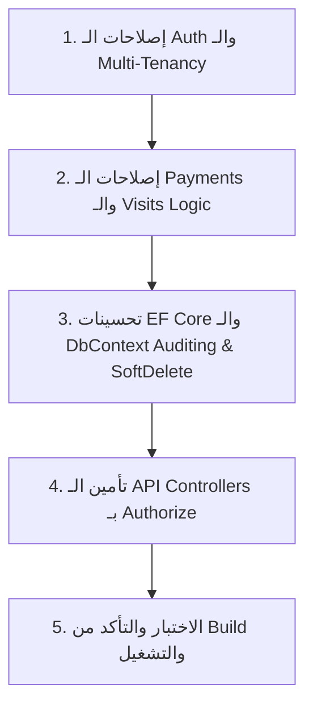

# 🏥 Smart Clinic - تقرير الفحص الشامل وخطة الإصلاحات الضرورية (Code Review & Action Plan)

تم إجراء مراجعة شاملة لجميع طبقات النظام:
- **SmartClinic.Domain**
- **SmartClinic.Application**
- **SmartClinic.Infrastructure**
- **SmartClinic.Persistence**
- **SmartClinic.API**

---

## 📑 فهرس المحتويات
1. [أهم نقاط القوة في المشروع](#-نقاط-القوة)
2. [المشاكل الحرجة والضرورية (Critical - 6 مشاكل)](#-المشاكل-الحرجة-والضرورية)
3. [المشاكل المتوسطة (Medium - 8 مشاكل)](#-المشاكل-المتوسطة)
4. [التحسينات والتوصيات المقترحة (Improvements - 10 تحسينات)](#-التحسينات-المقترحة)
5. [خطة التعديلات الميدانية عند البدء بالتنفيذ](#-خطة-التعديلات-خطوة-بخطوة)

---

## 🌟 نقاط القوة
- **Clean Architecture** مطبقة وفق المعايير الصحيحة: فصل كامل بين الـ Domain، Application، Infrastructure، و Persistence.
- **CQRS + MediatR** لتنظيم الـ Requests والـ Commands والـ Queries بشكل نظيف وقابل للتوسع.
- **FluentValidation Pipeline** متكامل عبر `ValidationBehavior` ينفذ الفحص قبل وصول الطلب للـ Handlers.
- **Unit of Work Pattern** مع Repositories مخصصة لكل Entity.
- **EF Core Configurations** منفصلة ونظيفة لكل Entity في الـ Persistence layer.
- **تشفير كلمات المرور** باستخدام مكتبة آمنة (BCrypt).
- **Global Exception Handling Middleware** لمعالجة الأخطاء والـ Validation Failures وتوحيد الـ Responses.

---

## 🔴 المشاكل الحرجة والضرورية (Critical Bugs)

### 1. خطأ في توليد JWT Token أثناء تسجيل المستخدم الجديد (Register)
- **الملف:** `SmartClinic.Application/Features/Authentication/Commands/Register/RegisterUserCommandHandler.cs`
- **المشكلة:** يتم استدعاء `_jwtProvider.GenerateToken(user)` قبل أن يتم إسناد `Id` للمستخدم أو حفظه في قاعدة البيانات، مما يجعل التوكن يحمل `Sub = Guid.Empty` (00000000-0000-0000-0000-000000000000).
- **الحل المقترح:**
  إسناد `user.Id = Guid.NewGuid()` قبل التوليد، أو استدعاء توليد التوكن بعد `_unitOfWork.SaveChangesAsync()`.

---

### 2. غياب التحقق من وجود الكشف وحالة الدفع في معالجة المدفوعات (Payments)
- **الملف:** `SmartClinic.Application/Features/Payments/Commands/ProcessPayment/ProcessPaymentCommandHandler.cs`
- **المشكلة:**
  1. لا يتم التحقق مما إذا كان الـ `VisitId` موجوداً بالفعل في النظام.
  2. لا يتم التحقق مما إذا كان الكشف تم سداده مسبقاً، مع العلم أن العلاقة 1-to-1 و جدول Payments يحتوي على Unique Index على `VisitId`.
  3. توليد رقم الإيصال `Random.Shared.Next(1000, 9999)` غير محمي من التكرار والاصطدام.
- **الحل المقترح:**
  - حقن `IVisitRepository` والتحقق من وجود الكشف.
  - التحقق من عدم وجود عملية دفع سابقة (`GetPaymentByVisitIdAsync`).
  - توليد `ReceiptNumber` فريد باستخدام Timestamp مع مقطع عشوائي من الـ Guid.

---

### 3. إمكانية حدوث Race Condition في رقم الدور (Queue Number)
- **الملف:** `SmartClinic.Persistence/Repositories/AppointmentRepository.cs`
- **المشكلة:** يتم حساب رقم الدور عبر استعلام `MaxAsync(QueueNumber) + 1`، وفي حال وصول طلبين في أجزاء من الثانية سيأخذ الاثنان نفس رقم الدور.
- **الحل المقترح:**
  إضافة Unique Index على مستوى قاعدة البيانات على الأعمدة `(DoctorBranchId, AppointmentDate, QueueNumber)` في `AppointmentConfiguration.cs`.

---

### 4. عزل بيانات العيادات (Multi-Tenancy Data Leak)
- **الملف:** `SmartClinic.Persistence/Repositories/PatientRepository.cs`
- **المشكلة:** الدالة `GetByIdAsync(Guid id)` تبحث عن المريض بالـ Id فقط دون التحقق من الـ `ClinicId` التابع لها المريض، مما يسمح بالوصول لبيانات مرضى عيادات أخرى في حال معرفة الـ ID.
- **الحل المقترح:**
  تضمين `ClinicId` في عمليات جلب والبحث عن المرضى والمستخدمين للتأكد من عزل المستأجرين (Tenant Isolation).

---

### 5. قيود البريد الإلكتروني للمستخدمين غير ملائمة للـ Multi-Tenancy
- **الملف:** `SmartClinic.Persistence/Configurations/UserConfiguration.cs`
- **المشكلة:** تم تعريف الـ Unique Index على `Email` فقط، مما يمنع مستخدماً من التسجيل بنفس البريد في عيادتين مختلفتين.
- **الحل المقترح:**
  تعديل الـ Index ليكون مركباً: `builder.HasIndex(u => new { u.ClinicId, u.Email }).IsUnique();`.

---

### 6. وقت انتهاء صلاحية التوكن Hardcoded في الاستجابة
- **الملفات:** `LoginCommandHandler.cs` و `RegisterUserCommandHandler.cs`
- **المشكلة:** يتم إرجاع `DateTime.UtcNow.AddMinutes(60)` بشكل ثابت داخل الـ Response بصرف النظر عن القيمة المحددة في `JwtSettings.ExpirationInMinutes`.
- **الحل المقترح:**
  جعل الاستجابة تستند إلى القيمة الفعلية من `JwtSettings`.

---

## 🟡 المشاكل المتوسطة (Medium Issues)

| # | المشكلة | الملف المعني | الحل المقترح |
|---|---------|--------------|--------------|
| 1 | **غياب الـ `[Authorize]` عن الـ Controllers** | جميع ملفات `SmartClinic.API/Controllers` | إضافة وسم `[Authorize]` وتحديد الصلاحيات بحسب الأدوار المطلوبة لكل Endpoint. |
| 2 | **عدم التحقق من حالة الموعد عند بدء الكشف** | `StartVisitCommandHandler.cs` | منع بدء الكشف إذا كان الموعد ملغياً `Cancelled` أو لم يحضر `NoShow`. |
| 3 | **استخدام `EnsureCreatedAsync` بدل الـ Migrations** | `DbInitializer.cs` | استبداله بـ `MigrateAsync()` لضمان توافق الترحيلات وقواعد البيانات الإنتاجية. |
| 4 | **تكرار الأطباء في نتائج الفروع** | `DoctorRepository.cs` | استخدام `.Distinct()` في دالة `GetDoctorsByBranchIdAsync`. |
| 5 | **تخزين المفتاح السري للـ JWT في الإعدادات بشكل مكشوف** | `appsettings.json` | نقله إلى Environment Variables أو User Secrets في بيئات التطوير والإنتاج. |
| 6 | **`ClinicsController` فارغ تماماً** | `ClinicsController.cs` | إضافة Endpoints إدارة العيادات والمستأجرين. |
| 7 | **قواعد الـ CORS مفتوحة بالكامل** | `Program.cs` | تحديد الـ Origins المسموح بها بدلاً من `AllowAnyOrigin()` في بيئة الإنتاج. |
| 8 | **فئة `Result.cs` فارغة في الـ Domain** | `SmartClinic.Domain/Common/Result.cs` | إما استكمال بنية Result Pattern أو حذف الملف غير المستخدم. |

---

## 🟢 التحسينات المقترحة (Improvements)

1. **Global Query Filter للحذف المنطقي (Soft Delete):**
   تفعيل Filter تلقائي في `SmartClinicDbContext.OnModelCreating` لكل الجداول التي تحتوي على `IsDeleted` لضمان عدم إرجاع البيانات المحذوفة دون الحاجة لكتابة الشرط يدوياً في كل Repository.
2. **التسجيل التلقائي لتواريخ التعديل والإنشاء (Auto Auditing):**
   تعديل `SaveChangesAsync` في `SmartClinicDbContext` لملء قيم `CreatedAt` و `UpdatedAt` تلقائياً.
3. **التحقق من جدول مواعيد الطبيب (Schedule Verification):**
   التحقق في `BookAppointment` من أن الطبيب متاح في هذا اليوم ولم يتجاوز الحد الأقصى للمرضى `MaxPatients`.
4. **إضافة Validators للـ Commands الناقصة:**
   - `UpdateVisitCommandValidator`
   - `StartVisitCommandValidator`
   - `ChangeAppointmentStatusCommandValidator`
5. **تعزيز شروط كلمة المرور:**
   تحديث `RegisterUserCommandValidator` ليتطلب 8 خانات وحروف كبيرة وأرقام.
6. **تنظيف المجلدات الفارغة:**
   حذف مجلد `SmartClinic.Persistence/NewFolder`.

---

## 🚀 خطة التعديلات خطوة بخطوة (عندما تبدأ بالتعديل)

1. **الخطوة 1:** تعديل `RegisterUserCommandHandler.cs` و `UserConfiguration.cs` لضبط التوكن وعزل الإيميلات بالعيادة.
2. **الخطوة 2:** تعديل `ProcessPaymentCommandHandler.cs` و `StartVisitCommandHandler.cs` لضبط منطق الكشوفات والدفعات.
3. **الخطوة 3:** تحديث `SmartClinicDbContext.cs` و `AppointmentConfiguration.cs` بإضافة الـ Unique Indexes والـ Global Query Filters والـ SaveChanges overriding.
4. **الخطوة 4:** إضافة الـ `[Authorize]` المناسب على الـ Controllers مع إضافة الـ Validators الناقصة.
5. **الخطوة 5:** تشغيل `dotnet build` والتأكد من استقرار المنظومة بالكامل.

---
*تم حفظ هذا التقرير في المجلد الرئيسي للمشروع ليكون مرجعاً دائماً لأعمال التطوير.*
