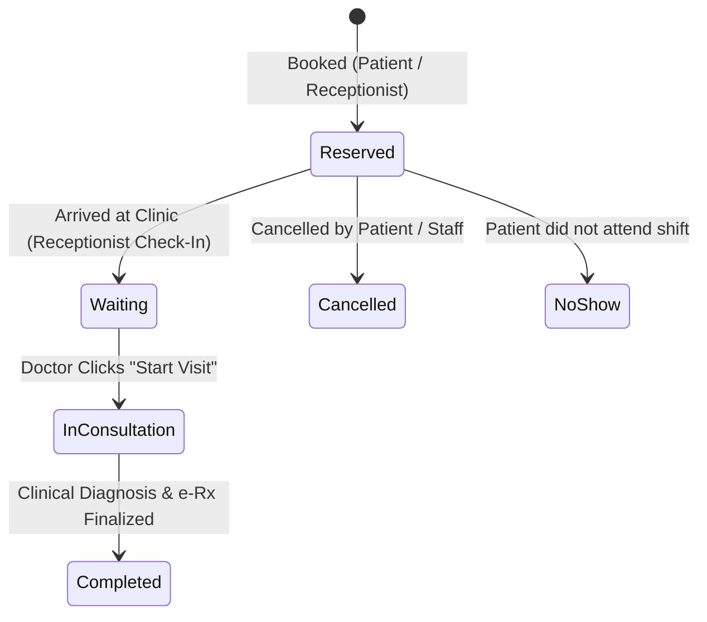

# 📅 Feature 06: Appointment Scheduling & Live Waiting Queue

## 📌 1. Overview & Operational Flow
The **Appointment Scheduling and Queue Management** engine orchestrates the daily patient flow from advance booking to physical clinic arrival, waiting room triage, and in-room physician examination.

---

## 🚦 2. Appointment Lifecycle & State Machine

### State Enum Definitions (`AppointmentStatus.cs`)
| Code | State Name | Color Badge | Meaning |
|---|---|---|---|
| `1` | **Reserved** | `badge-info` | Scheduled in advance. Awaiting patient physical arrival. |
| `2` | **Waiting** | `badge-warning` | Patient arrived in reception. Waiting in lobby for their turn. |
| `3` | **In Consultation** | `badge-primary` | Patient is currently inside the examination room with doctor. |
| `4` | **Completed** | `badge-success` | Examination and e-prescription finished. Ready for checkout. |
| `5` | **Cancelled** | `badge-danger` | Booking revoked prior to examination. |
| `6` | **No Show** | `badge-secondary` | Shift concluded without patient appearance. |

---

## 📥 3. The Receptionist Check-In Workflow

### 3.1 Seamless Handoff between Front Desk & Doctor
1. **Advance Booking**: Patient has an appointment in state `Reserved (1)`.
2. **Patient Arrival**: When the patient walks through the clinic door, the Receptionist opens `/appointments`.
3. **One-Click Check-In**: The Receptionist clicks the **`📥 Check-In`** button next to the patient's record.
4. **Instant State Transition**:
   - Backend `ChangeAppointmentStatusCommand` updates state to `Waiting (2)`.
   - The badge updates to `Waiting in Queue`.
5. **Real-time Appearance in Doctor Workspace**:
   - The patient immediately appears on the attending doctor's **Live Clinic Queue** with an active **`🚀 Start Visit`** button.

---

## 🏛️ 4. Domain Entities & Database Schema

### `Appointment` Entity
Located in: `SmartClinic.Domain/Entities/Appointments/Appointment.cs`
- `Id (Guid)`: Unique identifier.
- `ClinicId (Guid)`: Tenant identifier.
- `PatientId (Guid)`: Link to patient EMR.
- `DoctorBranchId (Guid)`: Link to the specific doctor shift at the branch.
- `AppointmentDate (DateOnly)`: Calendar day of the consultation.
- `StartTime (TimeOnly)`: Scheduled time slot.
- `AppointmentStatus (AppointmentStatus)`: Current lifecycle state.
- `QueueNumber (int)`: Order number in today's clinic waiting line.
- `Notes (string?)`: Patient symptoms, reason for visit, or referral notes.

---

## 🌐 5. API Endpoints (`AppointmentsController.cs`)

| Method | Endpoint | Description | Authorization |
|---|---|---|---|
| `POST` | `/api/Appointments/book` | Schedule a new patient consultation | `[Authorize]` |
| `PUT` | `/api/Appointments/status` | Change appointment state (e.g. Check-In to Waiting) | `[Authorize]` |
| `GET` | `/api/Appointments/doctor-branch/{id}` | Get schedule queue for a doctor shift by date | `[Authorize]` |
| `GET` | `/api/Appointments/patient/{patientId}` | Retrieve all appointments for a patient | `[Authorize]` |

---

## 💻 6. Frontend Components (Angular 19)

1. **`AppointmentsListComponent` (`/appointments`)**:
   - Branch, doctor, and date filtering.
   - Dynamic role-based action buttons:
     - **Receptionist**: Sees `📥 Check-In` for reserved slots, and `💳 Billing` for completed visits.
     - **Doctor**: Sees `🚀 Start Visit` to launch consultation.
2. **`AppointmentFormComponent` (`/appointments/new`)**:
   - Fast patient search, branch selection, doctor selection, and time allocation.
   - Accepts optional `?patientId=` query parameter to seamlessly book immediately after registering a new walk-in patient.
