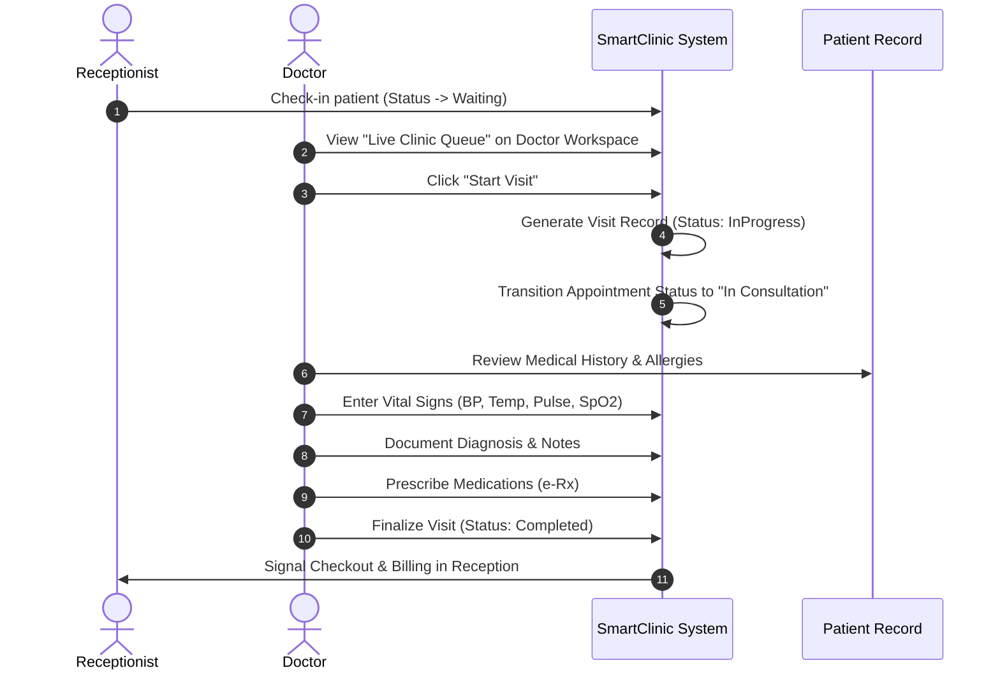

# 🩺 Feature 07: Clinical Consultations & Examination Visits

## 📌 1. Overview & Clinical Purpose
The **Clinical Consultations and Examination Visits** module represents the doctor-facing core of SmartClinic. It replaces traditional paper charts with an electronic clinical encounter workflow, allowing physicians to document chief complaints, record biometric vital signs, write physical exam findings, make ICD diagnoses, and issue treatments.

---

## 🏛️ 2. Domain Entities & Database Schema

### 2.1 `Visit` Entity
Located in: `SmartClinic.Domain/Entities/Clinical/Visit.cs`
- `Id (Guid)`: Unique identifier for the medical encounter.
- `AppointmentId (Guid)`: Link to scheduled appointment.
- `DoctorBranchId (Guid)`: Attending physician and facility context.
- `PatientId (Guid)`: Patient undergoing examination.
- `VisitDate (DateTime)`: Exact encounter timestamp.
- `ChiefComplaint (string)`: Primary symptom or reason described by patient.
- `Symptoms (string?)`: Clinical breakdown of presenting complaints.
- `PhysicalExamination (string?)`: Physical diagnostic findings.
- `Diagnosis (string)`: Final medical diagnosis or impression.
- `Notes (string?)`: Confidential physician notes.
- `VisitStatus (VisitStatus)`: `1: InProgress`, `2: Completed`, `3: Cancelled`.

### 2.2 Navigation Properties
- **Visit to Prescription (1-to-1)**: Every medical visit can generate an electronic prescription.
- **Visit to Payment (1-to-1)**: Every completed visit links to an accounts receivable invoice for reception billing.
- **Visit to Attachments (1-to-Many)**: Laboratory reports, X-rays, MRI scans, and ultrasound imaging files.

---

## 🩺 3. The Clinical Encounter Workflow

---

## 💻 4. Doctor Workspace Experience

### 4.1 Doctor Workspace Dashboard (`/dashboard`)
- Personalized hero welcoming the physician by full name and medical specialty with an **`Active On-Duty`** status indicator.
- **Real-Time Queue Counters**:
  - `Today's Appointments`: Total scheduled.
  - `In Waiting Room`: Live count of checked-in patients awaiting examination.
  - `Completed Visits`: Tally of patients already discharged.
- **Live Waiting Queue Table**:
  - Displays waiting patients in chronological arrival order.
  - One-click **`🚀 Start Visit`** button that creates the encounter and opens the examination screen.

### 4.2 Visit Examination Screen (`/visits/:id`)
- Displays patient demographic banner with allergy alerts prominently highlighted.
- **Vital Signs Input Panel**:
  - Blood Pressure (mmHg)
  - Heart Rate / Pulse (bpm)
  - Temperature (°C)
  - Blood Oxygen Saturation (SpO2 %)
- **Clinical Documentation Sections**:
  - Chief Complaint & Presenting Illness
  - Physical Examination Findings
  - Primary & Differential Diagnoses
  - Follow-up recommendation and return date.

---

## 🌐 5. API Endpoints (`VisitsController.cs`)

| Method | Endpoint | Description | Authorization |
|---|---|---|---|
| `POST` | `/api/Visits/start` | Initialize clinical visit from appointment | `[Authorize(Roles = "ClinicAdmin,PlatformAdmin,Doctor")]` |
| `GET` | `/api/Visits/{id}` | Retrieve complete visit encounter data | `[Authorize]` |
| `PUT` | `/api/Visits/{id}/diagnose` | Record clinical diagnosis, notes & exam | `[Authorize(Roles = "ClinicAdmin,PlatformAdmin,Doctor")]` |
| `POST` | `/api/Visits/{id}/complete` | Mark visit complete and trigger billing | `[Authorize(Roles = "ClinicAdmin,PlatformAdmin,Doctor")]` |
