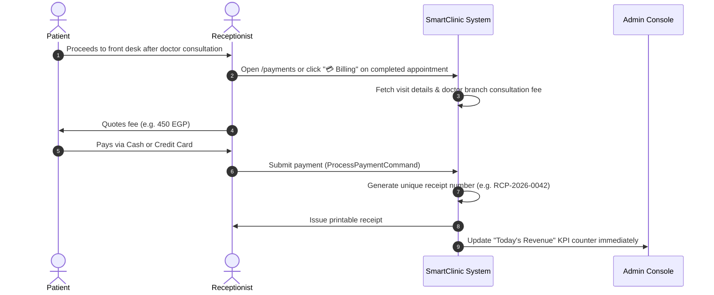

# 💳 Feature 09: Billing, Invoicing & Financial Operations

## 📌 1. Overview & Financial Controls
The **Billing and Payments** subsystem provides a transparent, auditable financial workflow for the clinic. It calculates consultation fees according to the physician's assigned branch rate, supports multiple payment methods, prints formal electronic receipts, and feeds real-time revenue telemetry into the executive dashboard.

---

## 🏛️ 2. Domain Entities & Database Schema

### `Payment` Entity
Located in: `SmartClinic.Domain/Entities/Billing/Payment.cs`
- `Id (Guid)`: Unique transaction identifier.
- `VisitId (Guid)`: Consultation encounter associated with this payment.
- `ReceiptNumber (string)`: Sequential or alphanumeric receipt code (e.g., `RCP-2026-0042`).
- `TotalAmount (decimal)`: Gross consultation amount before discounts.
- `DiscountAmount (decimal)`: Approved promotional or institutional discount.
- `NetAmount (decimal)`: Final amount collected (`TotalAmount - DiscountAmount`).
- `PaymentMethod (PaymentMethod)`:
  - `1`: **Cash**
  - `2`: **Credit Card**
  - `3`: **Insurance**
- `PaidAt (DateTime)`: Transaction timestamp.
- `CreatedByUserId (Guid)`: Staff member who collected the funds (Audit trail).

---

## 🔄 3. Front Desk Checkout & Payment Flow

---

## 📊 4. Financial Telemetry & Dashboards

### 4.1 Clinic Administrator Dashboard (`/dashboard`)
- **Today's Revenue KPI Card**:
  - Displays real-time aggregate cash and card intake (e.g., `2,450 EGP`).
  - Automatically recalculates on each processed transaction.
- **Financial Audit Log**:
  - Detailed listing of all receipts with timestamp, paying patient, attending physician, payment method, and operator ID.

### 4.2 Receptionist Console (`/payments`)
- Billing history directory showing all recent payments.
- Quick filters by receipt number and date range.
- Reprint functionality for patients requiring employer or insurance proof of payment.

---

## 🌐 5. API Endpoints (`PaymentsController.cs`)

| Method | Endpoint | Description | Authorization |
|---|---|---|---|
| `POST` | `/api/Payments/process` | Process consultation fee and issue receipt | `[Authorize(Roles = "ClinicAdmin,PlatformAdmin,Receptionist")]` |
| `GET` | `/api/Payments/visit/{visitId}` | Retrieve receipt details for a specific visit | `[Authorize]` |

---

## 🔒 6. Security & Financial Integrity
- Only authorized front desk staff and administrators can post payments.
- Doctors and patients cannot manipulate receipt amounts or discount ledgers.
- Every payment records the `CreatedByUserId` of the employee on duty to enforce accountability.
