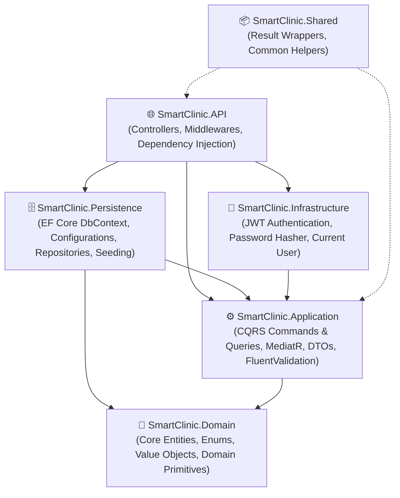
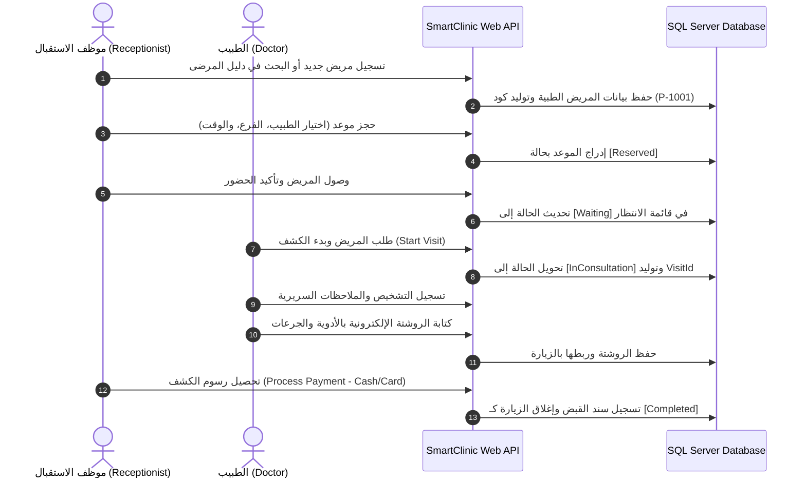

# 🏥 SmartClinic — Enterprise Multi-Tenant Smart Clinic Management System
### وثيقة الشرح الفني والهندسي الشامل للمشروع (Comprehensive Technical & Architectural Showcase)

[](https://dotnet.microsoft.com/)
[](https://angular.dev/)
[](https://blog.cleancoder.com/uncle-bob/2012/08/13/the-clean-architecture.html)
[](https://github.com/jbogard/MediatR)
[](https://docs.microsoft.com/en-us/ef/core/)
[](https://www.microsoft.com/en-us/sql-server/)
[](https://jwt.io/)

---

## 📌 الفهرس العام (Table of Contents)

1. [💡 النبذة التنفيذية والرؤية العامة (Executive Summary)](#1--النبذة-التنفيذية-والرؤية-العامة-executive-summary)
2. [🏛️ المعمارية الهندسية وأنماط التصميم (Architecture & Design Patterns)](#2-%EF%B8%8F-المعمارية-الهندسية-وأنماط-التصميم-architecture--design-patterns)
3. [💻 بنية الواجهة الأمامية وتجربة المستخدم (Frontend Architecture & UI/UX)](#3--بنية-الواجهة-الأمامية-وتجربة-المستخدم-frontend-architecture--uiux)
4. [✨ الموديولات الوظيفية ودورة العمل (Business Modules & Workflows)](#4--الموديولات-الوظيفية-ودورة-العمل-business-modules--workflows)
5. [👥 الأدوار وتخصيص الشاشات (Role-Based Access Control & Views)](#5--الأدوار-وتخصيص-الشاشات-role-based-access-control--views)
6. [🔑 جدول بيانات الدخول التجريبية (Pre-Seeded Accounts Matrix)](#6--جدول-بيانات-الدخول-التجريبية-pre-seeded-accounts-matrix)
7. [🚀 التشغيل السريع بنقرة واحدة (Quick Start & 1-Click Run)](#7--التشغيل-السريع-بنقرة-واحدة-quick-start--1-click-run)
8. [🗂️ الهيكل المنظم للملفات والمجلدات (Project Directory Layout)](#8-%EF%B8%8F-الهيكل-المنظم-للملفات-والمجلدات-project-directory-layout)

---

## 1. 💡 النبذة التنفيذية والرؤية العامة (Executive Summary)

**SmartClinic** هو نظام إدارة عيادات ومراكز طبية متعددة الفروع والمستأجرين (**Multi-Tenant SaaS Platform**) تم تصميمه وفق أعلى المعايير الهندسية للمؤسسات الكبرى (**Enterprise-Grade Standards**).

### الهدف الرئيسي من النظام:
توفير منصة سحابية مركزية متكاملة تتيح للمراكز الطبية والعيادات المستقلة إدارة كافة عملياتها التشغيلية والسريرية بكفاءة متناهية، بما يشمل:
- عزل بيانات كل عيادة كلياً مع دعم الفروع المتعددة.
- جدولة أوقات عمل الأطباء وتحديد أسعار الكشوفات والاستشارات بدقة.
- تنظيم حركة المرضى وطوابير الانتظار (Queue Management) لحظياً.
- أرشفة السجلات الطبية الإلكترونية للمرضى (**EMR - Electronic Medical Records**).
- إصدار الروشتات الطبية الرقمية، والتحصيل المالي وسندات القبض.
- لوحة تحليلات لحظية لمتابعة الإيرادات والإنتاجية الطبية مباشرة.

---

## 2. 🏛️ المعمارية الهندسية وأنماط التصميم (Architecture & Design Patterns)

يعتمد النظام بنية **Clean Architecture (Onion Architecture)** مع تطبيق مبدأ فصل المسؤوليات وقاعدة انعكاس الاعتماديات (Dependency Inversion Principle)، حيث تم تقسيم الـ Backend إلى 5 طبقات مستقلة تماماً:



### الأنماط والمفاهيم البرمجية المطبقة (Implemented Design Patterns):
1. **CQRS (Command Query Responsibility Segregation)**: فصل مسارات القراءة (Queries) عن مسارات الكتابة والتعديل (Commands) لتحقيق أعلى درجات الأداء وقابلية التوسع.
2. **MediatR Pipeline Pattern**: تمرير الطلبات عبر وسيط معزول مع إضافة سلوكيات تدقيق مسبقة (**ValidationBehavior via FluentValidation**) للتحقق من صحة المدخلات قبل وصولها للـ Handlers.
3. **Repository Pattern & Unit of Work**: تجريد طبقة الوصول لقاعدة البيانات وتوفير معاملات ذرية (Atomic Transactions).
4. **Domain-Driven Modularization**: تنظيم كافة الطبقات (Entities, Configurations, Repositories, Controllers) داخل مجلدات موديولات موحدة:
   - `Identity`: المستخدمون، الأدوار، وصلاحيات الوصول.
   - `Clinics`: العيادات، الفروع الجغرافية.
   - `Doctors`: الأطباء، التخصصات، إسناد الفروع، وجداول المواعيد.
   - `Patients`: بيانات المرضى والسجلات الطبية.
   - `Appointments`: حجوزات المواعيد وتتبع حالات الكشف.
   - `Clinical`: الكشوفات الطبية (Visits)، التاريخ المرضي، والروشتات (Prescriptions).
   - `Billing`: المدفوعات، الإيصالات المالية، وتتبع الإيرادات.

---

## 3. 💻 بنية الواجهة الأمامية وتجربة المستخدم (Frontend Architecture & UI/UX)

تم بناء الواجهة الأمامية باستخدام أحدث إصدار من إطار عمل **Angular 19**:

- **Standalone Components Architecture**: واجهات مستقلة بنسبة 100% خالية من الـ NgModules لسرعة التحميل وخفة الحجم.
- **Signals & Fine-Grained Reactivity**: استخدام تقنية Angular Signals لإدارة الحالة وتحقيق تحديث لحظي للواجهة بأعلى كفاءة.
- **Design System & Aesthetics**:
  - تصميم عصري بأسلوب **Dark Glassmorphism** مع لوحة ألوان دقيقة ومريحة للعين.
  - أيقونات تفاعلية دقيقة (SVG) وتأثيرات حركية خفيفة (Micro-animations).
  - دعم التبديل السلس بين الوضع الداكن والوضع الفاتح (Light / Dark Mode).
  - توافق كامل وتصميم متجاوب مع جميع أحجام الشاشات (Desktop, Tablet, Mobile).
- **Security & Interceptors**:
  - `authGuard`: حماية المسارات ومنع الوصول غير المصرح به وإعادة التوجيه التلقائي لصفحة الدخول.
  - `authInterceptor`: إرفاق توكن الـ JWT (`Bearer <Token>`) تلقائياً مع كل طلب خارج من الفرونت للباك.

---

## 4. ✨ الموديولات الوظيفية ودورة العمل (Business Modules & Workflows)

### أ. دورة حياة الكشف الطبي الكاملة (Patient Journey Workflow):



---

## 5. 👥 الأدوار وتخصيص الشاشات (Role-Based Access Control & Views)

يمتلك النظام منظومة صلاحيات متعددة الأدوار (RBAC)، وتتكيف الشاشات والقوائم الجانبية بناءً على نوع المستخدم المسجل:

### 1. مدير العيادة (Clinic Admin):
- **الهدف**: الإشراف العام وإدارة المنظومة.
- **ما يظهر له**: لوحة تحكم شاملة تتضمن إجمالي المرضى، الأطباء، الفروع النشطة، كشوفات اليوم، والإيرادات المالية الإجمالية. يمتلك صلاحية إضافة الفروع، تسجيل الأطباء وتحديد أسعارهم، وتعديل إعدادات المركز.

### 2. الطبيب (Doctor):
- **الهدف**: ممارسة العمل الطبي والسريري فقط.
- **ما يظهر له**: اسمه وشارة **Doctor**، جدول مواعيده اليومية، قائمة مرضاه المنتظرين في العيادة، شاشة فحص المريض (`Start Visit`)، كتابة التشخيص، كتابة الروشتة الرقمية (`Prescriptions`)، ومطالعة التاريخ المرضي وحساسيات المريض السابقة (EMR). ولا تظهر له الإعدادات الإدارية أو الفروع.

### 3. موظف الاستقبال (Receptionist):
- **الهدف**: إدارة صالة الاستقبال والحجوزات.
- **ما يظهر له**: تسجيل المرضى الجدد وفتح ملفاتهم، حجز المواعيد على أطباء الفروع، نقل المريض في طابور الانتظار، وتحصيل رسوم الكشوفات وتسجيل الفواتير (Payments).

### 4. المرضى (Patients):
- في أنظمة إدارة المراكز والعيادات الداخلية (EMR / Enterprise Clinic Systems)، المرضى هم **الملفات الطبية والسجلات السريرية** التي يتعامل معها الأطباء والاستقبال بدقة وأمان.

---

## 6. 🔑 جدول بيانات الدخول التجريبية (Pre-Seeded Accounts Matrix)

تم تجهيز قاعدة البيانات بحسابات متكاملة تغطي كافة الأدوار لتسهيل مراجعة وتقييم المشروع:

| الدور (Role) | الاسم (Full Name) | البريد الإلكتروني (Email) | كلمة المرور (Password) | التخصص / الفرع |
|---|---|---|---|---|
| 👑 **Clinic Admin** | System Administrator | `admin@smartclinic.com` | `Admin@123` | مدير النظام والعيادة |
| 👨‍⚕️ **Doctor** | Dr. Tamer Hosny | `tamer@smartclinic.com` | `Doctor@123` | استشاري قلب (Cardiology) - فرع وسط البلد |
| 👩‍⚕️ **Doctor** | Dr. Sarah Mansour | `sarah@smartclinic.com` | `Doctor@123` | استشاري أطفال (Pediatrics) - فرع وسط البلد |
| 👨‍⚕️ **Doctor** | Dr. Omar Farouk | `omar@smartclinic.com` | `Doctor@123` | جراحة عظام (Orthopedics) - فرع مصر الجديدة |
| 👩‍⚕️ **Doctor** | Dr. Mona El-Sayed | `mona@smartclinic.com` | `Doctor@123` | جلدية وتجميل (Dermatology) - فرع مصر الجديدة |
| 💼 **Receptionist** | Front Desk Receptionist | `receptionist@smartclinic.com` | `Reception@123` | موظف الاستقبال والحجوزات والمدفوعات |
| 🧑‍💼 **Patient** | Ahmed Mahmoud (Patient) | `patient@smartclinic.com` | `Patient@123` | كود طبي: `P-1001` (بوابة المريض وحجز الكشوفات) |

### 👥 عينة من المرضى المسجلين بقاعدة البيانات (6 Pre-Seeded Patients):
1. **Ahmed Mahmoud** | كود: `P-1001` | هاتف: `01011122233` | حساسية: بنسلين
2. **Mariam Youssef** | كود: `P-1002` | هاتف: `01022233344` | حساسية: ربو وغبار
3. **Khaled Mostafa** | كود: `P-1003` | هاتف: `01033344455` | تاريخ: ضغط دم مزمن
4. **Nourhan Ali** | كود: `P-1004` | هاتف: `01044455566` | حساسية: مركبات السلفا
5. **Ibrahim Hassan** | كود: `P-1005` | هاتف: `01055566677` | تاريخ: سكري نوع 2 وضغط
6. **Fatima El-Zahraa** | كود: `P-1006` | هاتف: `01066677788` | كشف عام

---

## 7. 🚀 التشغيل السريع بنقرة واحدة (Quick Start & 1-Click Run)

تم تجهيز ملفات تنفيذية مباشرة بنقرة واحدة داخل المجلد الرئيسي:

### ⚡ خيار التشغيل المباشر السريع (Recommended):
- **تشغيل العرض التقديمي (Interactive Presentation)**: انقر نقراً مزدوجاً على الملف:
  👉 [`run-presentation.bat`](file:///f:/Instant/Enterprise%20Multi-Tenant%20Smart%20Clinic%20Management%20System/run-presentation.bat)
- **تشغيل الباك إند**: انقر نقراً مزدوجاً على الملف:
  👉 [`run-backend.bat`](file:///f:/Instant/Enterprise%20Multi-Tenant%20Smart%20Clinic%20Management%20System/run-backend.bat)
- **تشغيل الفرونت إند**: انقر نقراً مزدوجاً على الملف:
  👉 [`run-frontend.bat`](file:///f:/Instant/Enterprise%20Multi-Tenant%20Smart%20Clinic%20Management%20System/run-frontend.bat)

### 💻 خيار التشغيل عبر التيرمينال (Manual CLI):
```powershell
# 1. تشغيل الباك إند (.NET 9)
cd smartclinic-backend/SmartClinic.API
dotnet run --launch-profile https

# 2. تشغيل الفرونت إند (Angular 19)
cd smartclinic-frontend
npm install   # في أول مرة فقط
npm start
```

### 🌐 الروابط عند التشغيل:
- **تطبيق الويب (Angular Web App)**: [http://localhost:4200](http://localhost:4200)
- **توثيق واختبار الـ API (Swagger UI)**: [https://localhost:7006/swagger](https://localhost:7006/swagger)
- *(تم تفعيل التحويل التلقائي بحيث لو فتحت [https://localhost:7006](https://localhost:7006) يفتح الـ Swagger فوراً)*.

---

## 8. 🗂️ الهيكل المنظم للملفات والمجلدات (Project Directory Layout)

تم تنظيف مجلد الـ Root تماماً، وتجميع ملفات التوثيق الفنية القديمة والمراحل في مجلد `docs/`، ليصبح الهيكل في قمة الاحترافية:

```text
Enterprise Multi-Tenant Smart Clinic Management System/
│
├── presentation/                          # 📽️ العرض التقديمي التفاعلي الشامل للمشروع
│   ├── index.html                         # شرائح العرض التفاعلية (15 شريحة Full English)
│   ├── styles.css                         # التصميم العصري بنظام Dark Glassmorphism
│   ├── app.js                             # كود التحكم، الانتقالات، والمؤقت الزمني
│   └── PRESENTATION_SPEAKER_SCRIPT.md     # دليل الإلقاء الشامل وإجابات أسئلة المناقشة
│
├── docs/                                  # 📁 كافة ملفات التوثيق التفصيلية والمراحل
│   ├── ADVANCED_ARCHITECTURE_AND_INFRASTRUCTURE.md
│   ├── CODE_REVIEW_REPORT.md
│   ├── DEVELOPMENT_GUIDE_FEATURE_WORKFLOW.md
│   ├── FRONTEND_ANGULAR_DOCUMENTATION.md
│   ├── PHASE0_AUTHENTICATION.md
│   ├── PHASE1_DOCTORS_BRANCHES_SPECIALIZATIONS.md
│   ├── PHASE2_PATIENTS_MEDICAL_HISTORY.md
│   ├── PHASE3_APPOINTMENTS_VISITS.md
│   ├── PHASE4_PRESCRIPTIONS_PAYMENTS.md
│   ├── PROJECT_OVERVIEW_AND_SERVICES.md
│   ├── RUN_COMMANDS.md
│   └── ACCOUNTS_AND_ROLES.md
│
├── smartclinic-backend/                   # 📁 سوليوشن ومشاريع الباك إند (.NET 9 Clean Architecture)
│   ├── SmartClinic.sln
│   ├── SmartClinic.API/                   # Controllers (Identity/Clinics/Doctors/Patients/...)
│   ├── SmartClinic.Application/           # Features CQRS (Commands/Queries/DTOs/Mapping)
│   ├── SmartClinic.Domain/                # Domain Entities (Identity/Clinics/Doctors/...)
│   ├── SmartClinic.Infrastructure/        # Security, JWT Providers, Password Hasher
│   ├── SmartClinic.Persistence/           # EF Core DbContext, Configurations, Repositories, Seeding
│   └── SmartClinic.Shared/                # Result Pattern & Shared Models
│
├── smartclinic-frontend/                  # 📁 تطبيق الواجهة الأمامية (Angular 19 Single Page App)
│   ├── src/
│   │   ├── app/
│   │   │   ├── core/                      # Guards, Interceptors, Models, Services
│   │   │   ├── features/                  # Auth, Dashboard, Doctors, Patients, Appointments, Visits...
│   │   │   └── shared/                    # Navigation Layout, Reusable Components
│   ├── angular.json
│   └── package.json
│
├── run-presentation.bat                   # 🚀 ملف تشغيل العرض التقديمي بنقرة واحدة
├── run-backend.bat                        # 🚀 ملف تشغيل الباك إند بنقرة واحدة
├── run-frontend.bat                       # 🚀 ملف تشغيل الفرونت إند بنقرة واحدة
├── PROJECT_DOCUMENTATION.md               # 📖 وثيقة الشرح الفني الشاملة للمشروع (هذا الملف)
└── README.md                              # 📖 الملف التعريفي العام بالمشروع
```

---

> **SmartClinic** — صُمم وطُوّر ليمثل نموذجاً حياً للمشاريع الطبية البرمجية الكبرى التي تجمع بين صرامة الهندسة المعمارية وقوة الأداء وجمال التصميم.
