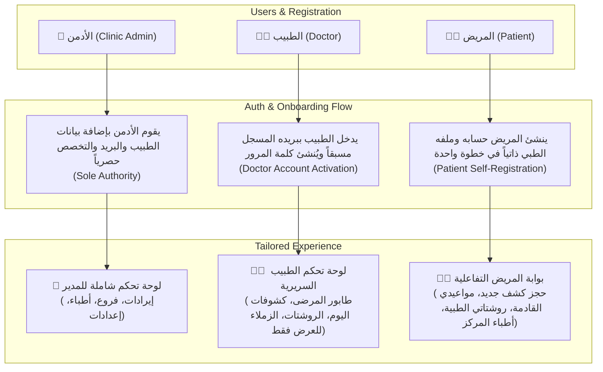

# 🏥 خطة العمل الهندسية لمنظومة الصلاحيات المتقدمة وتخصيص لوحات التحكم (RBAC & Multi-Role Dashboards)

تهدف هذه الخطة إلى هندسة وتنفيذ دورة العمل الحقيقية المطلوبة لنظام إدارة العيادات والمراكز الطبية **SmartClinic**، بحيث يتم الفصل الصارم والكامل بين الأدوار الثلاثة الرئيسية (**الأدمن Admin**، **الطبيب Doctor**، **المريض Patient**) في الواجهة الأمامية (Frontend) والواجهة الخلفية (Backend)، مع ضبط دورة تسجيل وتفعيل حسابات الأطباء والمرضى وتخصيص لوحات التحكم (Dashboards) بما يلائم طبيعة وصلاحيات كل مستخدم.

---

## 🔍 تقييم الوضع الحالي للمشروع (Current State vs. Missing Gaps)

### 1. ما هو منجز حالياً في المشروع (Currently Implemented):
- **الباك إند (.NET 9 - Clean Architecture)**:
  - وجود نظام الـ JWT Authentication وتوليد التوكن بمطالبات الـ Claims (Role, ClinicId, UserId).
  - وجود جدول للمستخدمين وربط بين كيان `User` وكيان `Doctor`.
  - كود إضافة الطبيب `CreateDoctorCommandHandler` ينشئ حساب طبيب ببريد وكلمة مرور افتراضية (`Doctor@123`).
  - العمليات السريرية (حجز المواعيد، الكشوفات Visits، الروشتات Prescriptions، المدفوعات).
- **الفرونت إند (Angular 19 Standalone Signals)**:
  - شاشة تسجيل الدخول `LoginComponent` لشخص يمتلك حساباً مسبقاً.
  - شاشة لوحة تحكم واحدة عامة للمدير `DashboardComponent` بها إحصائيات مالية وإدارية عامة.
  - شاشات عرض الأطباء والمواعيد والمرضى والمدفوعات.

### 2. ما هو ناقص ويحتاج إلى تنفيذ (Identified Gaps to Address):
- ❌ **دور المريض (Patient Role)** غير موجود في الـ Enum الخاص بالمستخدمين `UserType`، ولا يوجد ربط بين حساب المستخدم والملف الطبي للمريض.
- ❌ **عدم وجود شاشة تسجيل حساب جديد (Register / Sign Up)** في الفرونت إند، فالمريض لا يستطيع عمل حساب بنفسه.
- ❌ **عدم وجود آلية تفعيل/إنشاء كلمة مرور للطبيب (Doctor Activation Flow)**: الطبيب الذي يضيفه الأدمن يحتاج شاشة لإدخال بريده المسجل وتعيين كلمة المرور الخاصة به وتفعيل حسابه.
- ❌ **غياب الحماية الصارمة على إضافة الأطباء**: زر `Add New Doctor` يظهر لأي مستخدم، ومسار إضافة الطبيب في الباك إند غير مقيد حصرياً بـ `ClinicAdmin`.
- ❌ **عدم تخصيص القائمة الجانبية (Sidebar)**: جميع الروابط (أطباء، فروع، إعدادات، مدفوعات) تظهر للجميع حتى الطبيب والمريض.
- ❌ **عدم وجود لوحات تحكم مخصصة (Distinct Dashboards)**:
  - لا توجد لوحة تحكم خاصة بالطبيب تعرض طابوره اليومي وكشوفاته وأوقات عمله دون البيانات المالية للعيادة.
  - لا توجد بوابة/لوحة تحكم خاصة بالمريض (Patient Portal) تتيح له حجز موعد سريع، ورؤية مواعيده وروشتاته الطبية.
- ❌ **غياب حراس المسارات للصلاحيات (Role Guard)** لمنع الدخول المباشر عبر الـ URL لصفحات غير مصرح بها.

---

## 🎯 الهيكلية المعمارية المقترحة (Proposed Architectural Design)



---

## 🛠️ تفاصيل الحلول المقترحة (Proposed Solutions & Best Practices)

### 1. دورة انضمام الطبيب (Doctor Onboarding Flow):
- **قاعدة الأمان الأهم**: منع أي شخص غير مرخص من التسجيل كطبيب بنفسه داخل العيادة.
- **الخطوة 1 (الأدمن)**: يقوم الأدمن بإضافة بيانات الطبيب (الاسم، البريد الإلكتروني، التخصص، الترخيص، الفروع، وسعر الكشف).
- **الخطوة 2 (الطبيب)**: 
  - في صفحة التسجيل/الدخول، يوجد خيار **"تفعيل حساب طبيب / إنشاء كلمة المرور" (Doctor Activation)**.
  - يدخل الطبيب بريده الإلكتروني وكلمة المرور الجديدة المرغوبة.
  - يتحقق النظام:
    - إذا كان البريد مُسجلاً مسبقاً من قِبل إدارة العيادة: يتم حفظ وتشفير كلمة المرور وتفعيل الحساب فوراً وإصدار التوكن وتوجيهه إلى **لوحة تحكم الطبيب**.
    - إذا لم يكن البريد مسجلاً من الإدارة: يتم الرفض مع رسالة تنبيه واضحة: *"عفواً، هذا البريد غير مسجل لدى إدارة العيادة، يرجى التواصل مع مدير المركز لإضافتك كطبيب أولاً"*.

### 2. دورة تسجيل المريض (Patient Self-Registration Flow):
- في شاشة التسجيل (Register): خيار **"تسجيل مريض جديد" (Patient Registration)**.
- يدخل المريض: الاسم الكامل، البريد الإلكتروني، رقم الهاتف، النوع (ذكر/أنثى)، تاريخ الميلاد، وكلمة المرور.
- يقوم الباك إند بإنشاء:
  1. حساب مستخدم في جدول `Users` بدور `UserType.Patient`.
  2. ملف طبي كامل في جدول `Patients` يحمل نفس `ClinicId` و `UserId` مع توليد كود طبي فريد (مثل `P-2026-XXXX`).
- يتم توجيهه مباشرة إلى **بوابة المريض (Patient Portal)**.

### 3. الصلاحيات والقائمة الجانبية (Role-Based Sidebar & RBAC):
- **الأدمن (ClinicAdmin)**:
  - لوحة التحكم العامة (Dashboard) | المواعيد (Appointments) | المرضى (Patients) | المدفوعات (Payments) | الأطباء (Doctors مع زر الإضافة وإدارة الجداول) | الفروع (Branches) | الإعدادات (Settings).
- **الطبيب (Doctor)**:
  - لوحة الطبيب (Doctor Dashboard) | طابور ومواعيد اليوم (My Appointments & Queue) | ملفات المرضى وفحصهم (Patients & Visits) | كشوفاتي وروشتاتي السابقة (My Consultations & Prescriptions) | أطباء العيادة (Clinic Colleagues - **للعرض فقط وبدون زر إضافة**).
  - **يُحجب عنه**: المدفوعات الإدارية، إعدادات العيادة، إدارة الفروع، وإضافة/حذف الأطباء.
- **المريض (Patient)**:
  - بوابتي الصحية (Patient Dashboard) | حجز موعد كشف (Book Appointment) | مواعيدي وحجوزاتي (My Appointments) | روشتاتي الطبية وسجلاتي (My Prescriptions) | أطباء العيادة (Our Doctors).
  - **يُحجب عنه**: كافة بيانات العيادة الداخلية والملفات الطبية للمرضى الآخرين والإدارة والمدفوعات العامة.

### 4. لوحات التحكم الثلاثية المتميزة (3 Distinct Modern Dashboards):
- **Admin Dashboard**:
  - كروت: إجمالي الإيرادات، كشوفات اليوم، المرضى المسجلين، الأطباء النشطين، الفروع.
  - عمليات سريعة: إضافة فرع، إضافة دكتور، فتح ملف مريض، تقارير مالية.
- **Doctor Dashboard**:
  - بطاقة ترحيبية بالطبيب بتخصصه وعيادته.
  - كروت سريعة: مواعيدي اليوم (My Appointments Today)، مرضاي في غرفة الانتظار (Waiting in Queue)، كشوفاتي المنجزة (Completed Consultations).
  - قسم تفاعلي: **"طابور الانتظار اللحظي لعيادتي" (Live Clinic Queue)** مع زر بارز `🚀 بدء الكشف (Start Visit)` لأول مريض بالدور مباشرة دون الحاجة للبحث اليدوي.
  - جدول مواعيده في فروع العيادة لهذا الأسبوع.
- **Patient Dashboard**:
  - بطاقة شخصية للمريض باسمه وكوده الطبي.
  - زر مميز تفاعلي: **"احجز موعد كشف جديد" (Book New Appointment)**.
  - كارت الموعد القادم (Next Upcoming Appointment) مع شارة الحالة والوقت ورقم الانتظار.
  - قائمة روشتاتي الرقمية الصادرة (Recent Prescriptions) مع استعراض الأدوية وتوجيهات الطبيب وإمكانية الطباعة.
  - دليل الأطباء السريع لحجز موعد مباشر مع الطبيب المفضل.

---

## 📋 التغييرات المقترحة بالملفات (Proposed File Changes)

### أولاً: الباك إند (.NET 9 Backend)

#### [MODIFY] [UserType.cs](file:///f:/Instant/Enterprise%20Multi-Tenant%20Smart%20Clinic%20Management%20System/smartclinic-backend/SmartClinic.Domain/Enums/UserType.cs)
- إضافة قيمة `Patient = 5` للـ Enum.

#### [MODIFY] [Patient.cs](file:///f:/Instant/Enterprise%20Multi-Tenant%20Smart%20Clinic%20Management%20System/smartclinic-backend/SmartClinic.Domain/Entities/Patients/Patient.cs) & [User.cs](file:///f:/Instant/Enterprise%20Multi-Tenant%20Smart%20Clinic%20Management%20System/smartclinic-backend/SmartClinic.Domain/Entities/Identity/User.cs)
- إضافة خاصية الربط الاختياري `UserId` في كيان `Patient` لربط المريض بحسابه في جدول `Users` عند التسجيل الذاتي.

#### [NEW] [RegisterPatientCommand.cs](file:///f:/Instant/Enterprise%20Multi-Tenant%20Smart%20Clinic%20Management%20System/smartclinic-backend/SmartClinic.Application/Features/Authentication/Commands/RegisterPatient/RegisterPatientCommand.cs)
- Command مع الـ Handler لإنشاء حساب مريض جديد وتوليد سجله الطبي وإصدار JWT Token فوري له.

#### [NEW] [ActivateDoctorCommand.cs](file:///f:/Instant/Enterprise%20Multi-Tenant%20Smart%20Clinic%20Management%20System/smartclinic-backend/SmartClinic.Application/Features/Authentication/Commands/ActivateDoctor/ActivateDoctorCommand.cs)
- Command للتحقق من أن البريد الإلكتروني للطبيب مسجل مسبقاً من الإدارة، وتعيين كلمة المرور وتفعيل الحساب وإرجاع الـ JWT Token.

#### [MODIFY] [AuthController.cs](file:///f:/Instant/Enterprise%20Multi-Tenant%20Smart%20Clinic%20Management%20System/smartclinic-backend/SmartClinic.API/Controllers/Identity/AuthController.cs)
- إضافة Endpoint لتسجيل المريض: `POST /api/Auth/register-patient`.
- إضافة Endpoint لتفعيل حساب الطبيب وإنشاء كلمة المرور: `POST /api/Auth/activate-doctor`.

#### [MODIFY] [DoctorsController.cs](file:///f:/Instant/Enterprise%20Multi-Tenant%20Smart%20Clinic%20Management%20System/smartclinic-backend/SmartClinic.API/Controllers/Doctors/DoctorsController.cs)
- تقييد مسار إضافة الطبيب `[Authorize(Roles = "ClinicAdmin,PlatformAdmin")]` لضمان عدم استطاعة أي طبيب أو مستخدم آخر إضافة أطباء.

#### [NEW] استعلامات خاصة بالمريض والطبيب:
- Endpoint لجلب مواعيد الطبيب الخاص المسجل حالياً: `GET /api/Appointments/my-doctor-appointments`.
- Endpoint لجلب مواعيد وروشتات المريض المسجل حالياً: `GET /api/Appointments/my-patient-appointments` و `GET /api/Prescriptions/my-prescriptions`.

#### [MODIFY] [DbInitializer.cs](file:///f:/Instant/Enterprise%20Multi-Tenant%20Smart%20Clinic%20Management%20System/smartclinic-backend/SmartClinic.Persistence/Seed/DbInitializer.cs)
- إضافة Seeding لدور `Patient` وحساب تجريبي لمريض مسجل (مثلاً: `patient@smartclinic.com / Patient@123`) لتسهيل الاختبار والعرض.

---

### ثانياً: الواجهة الأمامية (Angular 19 Frontend)

#### [MODIFY] [auth.models.ts](file:///f:/Instant/Enterprise%20Multi-Tenant%20Smart%20Clinic%20Management%20System/smartclinic-frontend/src/app/core/models/auth.models.ts)
- دعم أنواع المستخدمين الجديدة وإضافة موديلات الـ Register للمريض وتفعيل الطبيب.

#### [MODIFY] [auth.service.ts](file:///f:/Instant/Enterprise%20Multi-Tenant%20Smart%20Clinic%20Management%20System/smartclinic-frontend/src/app/core/services/auth.service.ts)
- إضافة دالات `registerPatient()` و `activateDoctor()` وتوفير Signals لحالة الدور الحالي (`isDoctor()`, `isAdmin()`, `isPatient()`).

#### [NEW] [role.guard.ts](file:///f:/Instant/Enterprise%20Multi-Tenant%20Smart%20Clinic%20Management%20System/smartclinic-frontend/src/app/core/guards/role.guard.ts)
- حارس مسارات ذكي يتحقق من مصفوفة الأدوار المصرح لها قبل دخول أي صفحة (مثلاً: حماية `/doctors/new` للأدمن فقط).

#### [NEW] [register.component.ts](file:///f:/Instant/Enterprise%20Multi-Tenant%20Smart%20Clinic%20Management%20System/smartclinic-frontend/src/app/features/auth/register/register.component.ts)
- شاشة تسجيل عصرية جذابة بنظام Dark Glassmorphism، تحتوي على تبويبين:
  1. **تسجيل مريض جديد (Patient Registration)**: يدخل بياناته وينشئ حسابه ويدخل مباشرة لبوابته.
  2. **تفعيل حساب طبيب (Doctor Activation)**: يكتب الطبيب بريده المعطى للإدارة وكلمة مروره، فيتم التحقق والتفعيل الفوري.

#### [MODIFY] [login.component.ts](file:///f:/Instant/Enterprise%20Multi-Tenant%20Smart%20Clinic%20Management%20System/smartclinic-frontend/src/app/features/auth/login/login.component.ts)
- إضافة رابط ينقل لصفحة التسجيل الجديدة ("ليس لديك حساب؟ سجل كمريض أو فعّل حسابك كطبيب").
- توجيه المستخدم بعد تسجيل الدخول تلقائياً إلى شاشته المناسبة حسب دوره:
  - الأدمن -> لوحة الأدمن العامة.
  - الطبيب -> لوحة تحكم الطبيب السريرية.
  - المريض -> بوابة المريض الصحية.

#### [MODIFY] [sidebar.component.ts](file:///f:/Instant/Enterprise%20Multi-Tenant%20Smart%20Clinic%20Management%20System/smartclinic-frontend/src/app/shared/layout/sidebar/sidebar.component.ts)
- تعديل القائمة الجانبية لتكون ديناميكية 100% بناءً على دور المستخدم المسجل:
  - الأدمن: كافة الصلاحيات.
  - الطبيب: كشوفاته، مرضاه، الروشتات، زملاؤه، جدوله.
  - المريض: بوابته، حجز كشف، مواعيده، روشتاته، قائمة الأطباء.

#### [NEW] [doctor-dashboard.component.ts](file:///f:/Instant/Enterprise%20Multi-Tenant%20Smart%20Clinic%20Management%20System/smartclinic-frontend/src/app/features/dashboard/doctor-dashboard/doctor-dashboard.component.ts)
- لوحة تحكم متخصصة ومبهرة للطبيب:
  - إحصائيات المواعيد الخاصة به، طابور الانتظار المباشر، زر بدء الكشف السريع، أوقات دوامه الأسبوعية.

#### [NEW] [patient-dashboard.component.ts](file:///f:/Instant/Enterprise%20Multi-Tenant%20Smart%20Clinic%20Management%20System/smartclinic-frontend/src/app/features/dashboard/patient-dashboard/patient-dashboard.component.ts)
- بوابة مريض فائقة الجمال والسهولة:
  - كارت الموعد القادم ورقم الكشف.
  - حجز موعد كشف بضغطة زر.
  - استعراض الروشتات الطبية مع أسماء الأدوية وطريقة الاستخدام الصادرة له.
  - استعراض أطباء العيادة ومؤهلاتهم وتخصصاتهم.

#### [MODIFY] [dashboard.component.ts](file:///f:/Instant/Enterprise%20Multi-Tenant%20Smart%20Clinic%20Management%20System/smartclinic-frontend/src/app/features/dashboard/dashboard.component.ts)
- تحويل الـ Dashboard إلى مكون ذكي يقرأ دور المستخدم الحالي ويعرض تلقائياً اللوحة الملائمة له (`AdminDashboard` أو `DoctorDashboard` أو `PatientDashboard`).

#### [MODIFY] [doctors-list.component.ts](file:///f:/Instant/Enterprise%20Multi-Tenant%20Smart%20Clinic%20Management%20System/smartclinic-frontend/src/app/features/doctors/doctors-list/doctors-list.component.ts)
- إخفاء زر `+ Add New Doctor` وزر `Manage Schedule` عن الأطباء والمرضى، وقصر هذه الأزرار على الأدمن فقط. بالنسبة للطبيب تظهر الصفحة كدليل للزملاء والتواصل الداخلي، وبالنسبة للمريض تظهر كدليل تخصصات مع إمكانية حجز موعد.

---

## 🧪 خطة الفحص والتحقق (Verification Plan)

### 1. الفحص الآلي وبناء المشروع:
- التحقق من بناء الباك إند:
  ```powershell
  dotnet build "f:\Instant\Enterprise Multi-Tenant Smart Clinic Management System\smartclinic-backend\SmartClinic.sln"
  ```
  التأكد من عدم وجود أي خطأ أو تحذير (0 Errors, 0 Warnings).
- التحقق من بناء الفرونت إند:
  ```powershell
  cd smartclinic-frontend
  npm run build
  ```
  التأكد من اكتمال الـ compilation بنجاح وبدون أخطاء توافقية أو استيراد.

### 2. الفحص اليدوي واختبار السيناريوهات (Manual User Flow Verification):
1. **سيناريو الأدمن**:
   - الدخول بحساب `admin@smartclinic.com / Admin@123`.
   - التأكد من ظهور كامل عناصر القائمة الجانبية وإحصائيات المركز.
   - الدخول إلى صفحة الأطباء والتأكد من وجود زر `Add New Doctor` وإضافة طبيب جديد بنجاح.
2. **سيناريو تفعيل ودخول الطبيب**:
   - الدخول إلى صفحة التسجيل والتجربة كطبيب:
     - اختبار إدخال بريد غير مسجل من الإدارة -> التأكد من رفض النظام وإظهار رسالة التنبيه.
     - اختبار إدخال بريد طبيب مضاف من الإدارة (مثل `tamer@smartclinic.com`) وتعيين باسورد جديد -> التأكد من نجاح التفعيل والتسجيل الفوري.
   - تسجيل الدخول كطبيب (`tamer@smartclinic.com`).
   - التأكد من فتح **لوحة تحكم الطبيب (Doctor Dashboard)** بدلاً من لوحة الأدمن.
   - التأكد من أن القائمة الجانبية تخلو من (المدفوعات العامة، الفروع، الإعدادات).
   - فتح صفحة الأطباء والتأكد التام من **اختفاء** زر `Add New Doctor`.
3. **سيناريو المريض**:
   - فتح صفحة التسجيل `Register` -> اختيار تسجيل مريض جديد.
   - إنشاء حساب مريض ببيانات حقيقية كاملة.
   - التأكد من نقله فوراً إلى **بوابة المريض (Patient Dashboard)**.
   - التأكد من شكل البوابة المخصصة للمريض، وإجراء حجز موعد كشف، ومشاهدة قائمة الروشتات والأطباء.
   - محاولة كتابة الرابط `/doctors/new` أو `/payments` والتأكد من منعه بواسطة `RoleGuard`.
